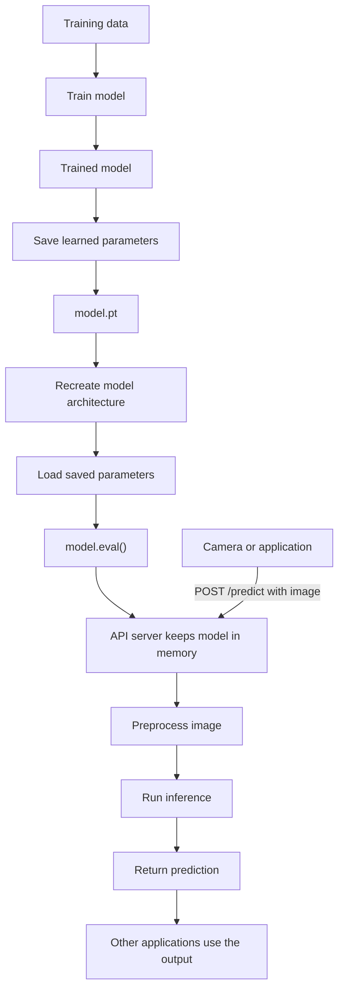

# Machine Learning

## Fundamentals

A **machine learning(ML)** model is fundamentally a parameterized mathematical function, or a composition of such functions, whose parameters are learned from data rather than having every decision rule explicitly programmed.

A **Dataset** is the collection of data used for training and evaluating ML.

A **sample** is one individual example in a dataset.

Parameters are values learned by a model during training, including weights and biases.

Weights control how strongly an input value influences the prediction of the model.

$$
z = 2x_1 + 0.1x_2
$$

the first input has weight \(2\), while the second has weight \(0.1\).

Bias is an additional learned value.

For a neuron:

$$
z = w^T x + b = w_1x_1 + w_2x_2 + \cdots + w_nx_n + b
$$

Here, $z$ is the pre-activation value—the raw weighted sum before the activation function.

$$
a = \sigma(z)
$$

where $a$ is the activation/output of the neuron and $\sigma$ is the activation function.

$$
\boxed{x \rightarrow z = w^T x + b \rightarrow a = \sigma(z)}
$$

- $w_1, w_2, \ldots, w_n$ are the weights and are learnable parameters.
- $b$ is the bias and is also a learnable parameter.
- $x_1, x_2, \ldots, x_n$ are the inputs and are not parameters.

Example activation functions are:

- ReLU: Returns zero for negative inputs and the input itself for positive inputs.
- Tanh: Maps inputs to values between $-1$ and $1$.
- Sigmoid: Maps inputs to values between $0$ and $1$.
- Softmax: Converts a vector of raw outputs into a probability distribution.

$$
z = Wx + b
$$

Notice that the weight matrix and the bias usually do not have the same shape. This is because ther is one bias for each *output* neuron

$$
W \in \mathbb{R}^{64 \times 128}
$$

then typically:

$$
b \in \mathbb{R}^{64}
$$

Hyperparameters are chosen/configured values like:

- Learning rate: Controls how much the model's parameters are adjusted during each update.
- Batch size: Specifies how many training examples are processed before the model's parameters are updated.
- Number of layers: Determines the depth of a neural network and how many stages of representation it can learn.
- Number of neurons: Determines the capacity of each layer to learn patterns from the data.
- Number of epochs: Specifies how many times the model processes the entire training dataset.
- Dropout rate: Specifies the proportion of neurons temporarily disabled during training to reduce overfitting.

## Preprocessing

Preprocessing transforms raw data into a consistent form that a model can learn from. The transformations must be fitted using only the training data and then applied unchanged to validation, test, and inference data to avoid data leakage.

### Data Pipelines

A **data pipeline** is an automated sequence that moves data from its sources to a destination while performing steps such as validation, cleaning, and transformation.

- **ETL (Extract, Transform, Load):** Data is transformed before it is loaded into the destination. It is useful when the destination should contain only clean, standardized, or privacy-filtered data and the required structure is known in advance.
- **ELT (Extract, Load, Transform):** Raw data is loaded first and transformed inside the destination, such as a data lake, data warehouse, or lakehouse. It is useful when large amounts of data must be retained and transformed in different ways for different use cases.

Modern ML systems often use **ELT** because retaining the raw data allows experiments, features, and preprocessing steps to change without extracting the data again. **ETL** is still appropriate when sensitive or invalid data must be removed before storage or when the model depends on a fixed, well-defined dataset.

Here, **load** means writing data into a persistent destination such as a database, data warehouse, data lake, or lakehouse. It does not mean loading data into a PyTorch tensor. That happens later when the ML program reads the stored data and represents each sample numerically—for example, as token IDs for text, pixel values for images, or encoded values for categories.

```text
Data sources -> ETL/ELT pipeline -> persistent storage -> Dataset -> tensors -> DataLoader -> model
```

**Normalization**

Normalization rescales numerical features so that features with large values do not dominate those with smaller values. Common approaches include scaling values to a fixed range, such as $[0, 1]$, and standardizing them to have a mean of $0$ and a standard deviation of $1$.

**Missing Values**

Missing values can be removed when they are rare or filled using an appropriate estimate, such as the mean, median, mode, or a model-based value. The chosen method should preserve useful patterns without introducing misleading information.

For training, samples are commonly represented as **PyTorch tensors**, which are multidimensional arrays of numbers that support GPU operations and automatic differentiation. Creating the tensor can be part of preprocessing, and other preprocessing operations, such as normalization, can operate on the tensor afterward.

A `DataLoader` reads samples from a `Dataset` and feeds their tensor representations to the training loop, usually in batches. This is separate from the **load** step in ETL or ELT.

```python
# Importing the DataLoader class from Pytorch
from torch.utils.data import DataLoader

loader = DataLoader(
    dataset,
    batch_size=32,
    shuffle=True
)
```

## Training

Training is the process of adjusting the model's parameters so its predictions become better.

$$
x \rightarrow \text{model} \rightarrow \hat{y} \rightarrow L(y, \hat{y}) \rightarrow \text{update parameters}
$$

Inference means using an already trained model for prediction.

$$
x \rightarrow \text{trained model} \rightarrow \hat{y}
$$

### Learning Techniques

**Supervised learning** → training data consists of  example inputs mapped to labelled outputs.

Example: (lung CT scan → COVID positive)

Common tasks: classification and regression.

**Classification** model involves predicts a class. Example: Spam / not spam.

Cross - entropy loss is the most common loss function for classification at training time whereas precision, recall etc are the evaluation metrics used.

**Regression** model predicts a continuous numerical value. Example: House price → $450,000. Temperature data → 27.3°C

In Regressions MAE, MSE, etc maybe be used as both the loss functions at training time and the evaluation metrics at inference time.

**Unsupervised learning** → training data consists of example inputs without any output labels.

The algorithm tries to discover structure or patterns in the data.

Common tasks: Clustering, dimensionality reduction, anomaly detection.

**Clustering** groups samples so that samples within the same cluster are more similar to one another than to samples in other clusters. In distance-based terms, the goal is usually **low intra-cluster distance** between samples in the same cluster and **high inter-cluster distance** between samples in different clusters. These ideas are sometimes called intra-class and inter-class distance, but **cluster** is the more precise term here because the groups are discovered rather than provided as known classes. Similarity is calculated from the input features using a distance or similarity measure.

Unlike classification, clustering is not given predefined classes or labeled examples. It discovers groups from the data, and the resulting cluster numbers have no inherent meaning. A person must inspect the clusters and decide what, if anything, they represent.

For example, a model using a clustering algorithm could receive customer features such as purchase frequency, average order value, and time since the last purchase. It might discover groups corresponding to frequent customers, occasional high spenders, and inactive customers without being given those categories in advance.

Common clustering algorithms make different assumptions:

- **K-means** requires the number of clusters, $k$, to be chosen beforehand and works best for compact, roughly spherical clusters.
- **Hierarchical clustering** builds a hierarchy of nested clusters that can be visualized as a dendrogram.
- **DBSCAN** finds dense regions, can identify irregularly shaped clusters, and treats isolated samples as noise without requiring the number of clusters beforehand.

Outliers can distort clustering results. K-means is particularly sensitive because an extreme value can pull a cluster's centroid toward itself, potentially producing misleading clusters. Outliers are therefore often detected, investigated, transformed, or removed before using K-means, depending on whether they are errors or meaningful rare cases.

DBSCAN handles outliers differently: it labels samples outside sufficiently dense regions as **noise** instead of forcing them into a cluster. A large number of noise points can mean that the dataset genuinely contains many isolated samples, but it can also indicate unsuitable settings. A neighborhood radius that is too small or a minimum-neighbor requirement that is too high causes more samples to be labeled as noise. DBSCAN can also struggle when the natural clusters have very different densities because one set of density settings may not fit every cluster.

Feature selection and scaling are especially important because irrelevant features or features with much larger numerical ranges can dominate the similarity calculation. Since there are usually no correct labels to compare against, clustering is commonly assessed using measures such as the silhouette score, the stability of clusters across runs or samples, and whether the discovered groups are useful in the problem domain.

**Self Supervised Learning** → Training data also consists of unlabel examples, but you create supervised style prediction tasks from the data itself. Modern LLMs use this often.

Example:
The cat sat on the mat.
Hide the word sat and make the predict it:
The cat __ on the mat.
Hence, the original data provided the label automatically.

**Reinforcement Learning** → An agent interacts with an environment and receives rewards. The agent learns a policy for choosing actions that maximize expected cumulative reward. Example: Training an agent to play mario.

Conceptually: Agent→Action→Environment→Reward

**Fine-Tuning** takes a pretrained model and trains it further on a specialized dataset for a more specific task or domain.

**Forward pass** means sending the input through the network once to calculate an output.

At the final layer, $\hat{y}$ is the model's prediction, while $y$ is the actual/ground-truth label. For example, $y = 1$ and $\hat{y} = 0.87$.

$$
\boxed{x \rightarrow z \rightarrow a \rightarrow \cdots \rightarrow \hat{y} \rightarrow L(y, \hat{y})}
$$

### Backpropagation and Gradient

**Loss function** quantifies how wrong the model's predictions is.

$$
L(y, \hat{y})
$$

Training tries to minimize the Loss function.

**Gradient** tells us how the changes with respect to a parameter.

For a parameter \(w\):

$$
\frac{\partial L}{\partial w}
$$

**Backpropagation** efficiently calculates those gradients throughout a neural network. It is called so because it works in a flow backward/opposite to the prediction.

$$
x \rightarrow L_1 \rightarrow L_2 \rightarrow L_3 \rightarrow \text{Loss}
$$

**Gradient descent:** Uses the calculated gradients to update the parameters. Very basic example of gradient descent:

$$
w_{\text{new}} = w_{\text{old}} - \eta \frac{\partial L}{\partial w}
$$

$$
w_{\text{new}} = w_{\text{old}} - \eta \nabla L
$$

where $n$ is the **learning rate**. It decides how large each parameter update is.

$n$ Too high → training can become unstable.

$n$ Too low → training can be extremely slow.

An **optimizer** is the algorithm responsible for updating the model parameters using the gradients.

Example:
SGD(Stochastic Gradient Descent)
Adam
AdamW

Generally data is divided into **batches** instead of processing the entire dataset.

Dataset = 100,000 examples
Batch size = 32

One **epoch** means the model has gone through the entire training dataset once.

**Training set** — used to update parameters.

**Validation set** — used during development to evaluate choices such as hyperparameters and detect overfitting.

**Test set** — held back until the end to estimate performance on unseen data.

### Generalization

Generalization means a models ability to perform well on new, unseen data.

**Overfitting** means the model learns the training data too specifically and doesn't generalize well.

Training accuracy:   99%
Validation accuracy: 78%

**Underfitting** means the model hasn't learned the underlying pattern sufficiently.

Training accuracy:   65%
Validation accuracy: 64%

#### Regularization

**Regularization** is a technique used during model training to reduce overfitting and improve generalization.

It discourages a model from fitting noise or relying too heavily on particular features, usually by limiting its effective complexity.

For methods that add a penalty to the loss function, the training objective becomes:

$$
L_{\text{total}} = L_{\text{prediction}} + \lambda R(\theta)
$$

- $L_{\text{prediction}}$ measures prediction error.
- $R(\theta)$ penalizes model complexity based on parameters $\theta$.
- $\lambda$ scales the regularization penalty.

##### L1 and L2 Regularization

Suppose the normal loss only measures prediction error:

$$
L = L_{\text{prediction}}
$$

L1 and L2 regularization add a penalty based on the model's weights to this loss:

$$
L_{\text{total}} = L_{\text{prediction}} + \lambda R(w)
$$

For **L1 regularization**, the penalty is the sum of the absolute weight values:

$$
L_{\text{total}} = L_{\text{prediction}} + \lambda \sum_i |w_i|
$$

For **L2 regularization**, the penalty is the sum of the squared weight values:

$$
L_{\text{total}} = L_{\text{prediction}} + \lambda \sum_i w_i^2
$$

The optimizer is therefore balancing two goals:

$$
\text{minimize prediction error} + \text{limit model complexity}
$$

Here, $\lambda$ controls how strongly the regularization penalty influences training:

- A small $\lambda$ produces weak regularization, so prediction error has more influence on training. If it is too small, the model may overfit.
- A large $\lambda$ produces strong regularization, so the penalty has more influence on training. If it is too large, the model may underfit.

The intuition is that if two models make similarly accurate predictions on the training data, regularization prefers the model that achieves this with less extreme or fewer influential weights. This reduces the model's ability to fit noise and peculiarities in the training data.

L1 and L2 produce different behavior:

- **L1 regularization** can drive some weights to exactly zero, effectively removing the corresponding features and producing a sparse model.
- **L2 regularization** penalizes increasingly large weights more strongly because the weights are squared. It usually shrinks weights toward zero without making them exactly zero, producing a model that distributes influence more smoothly across its features. Weight decay is a common implementation of this idea.

For both methods, the goal is not to eliminate every weight.

Other common regularization techniques include:

- **Dropout:** Randomly disables a proportion of neurons during each training step so the network does not depend too heavily on particular neurons. Dropout is disabled during inference.
- **Early stopping:** Stops training when validation performance stops improving, preventing the model from continuing to fit the training data too closely.
- **Data augmentation:** Creates varied training examples, such as rotated or cropped images, so the model learns patterns that remain useful across changes in the input.

## Types of ML Models

There are different kinds of ML models:

- Linear regression
- Logistic regression
- Decision trees
- Random forests
- kNN
- SVM(Support Vector Machines)
- Neural networks:
  - MLP
  - CNNs
  - RNNs
  - Transformerss

A **neuron** is a small parameterized mathematical function within a neural network that transforms its inputs into an output, typically using learned weights and a bias followed by an activation function.

A **layer** is a collection of one or more neurons that operate on an input representation to produce another representation.

A **neural network** is an ML model constructed by composing layers of parameterized mathematical transformations.

Why "neural"? Neural networks were originally inspired by biological neural networks in the brain. A biological neuron receives electrochemical signals from other neurons through connections called synapses. Different synapses can have different strengths, influencing how strongly an incoming signal affects the neuron. The neuron integrates these incoming signals and, if sufficiently activated, sends a signal onward to other neurons.

**Deep learning** is a subset of machine learning that uses multi layer neural networks to learn complex patterns from data.

**Embeddings** is a high dimensional repesentation of a quantity token, image, users, products.

## Deployment



```python
torch.save(model.state_dict(), "model.pt")
```

In PyTorch, the standard approach is to save the model's `state_dict` into a .pt file.

The state_dict is essentially a dictionary containing the model's learned parameters:

```text
{
    "layer1.weight": tensor(...),
    "layer1.bias":   tensor(...),
    "layer2.weight": tensor(...),
    "layer2.bias":   tensor(...)
}
```

Expose the model through an API, like in a Fast API server.

```python
from fastapi import FastAPI
import torch

app = FastAPI()

# MyModel() creates architecture with initial parameters
model = MyModel()

# load_state_dict() combines Architecture + trained parameters
model.load_state_dict(torch.load("model.pt"))
model.eval()

# torch.inference_mode() tells PyTorch that you're only doing inference, so it doesn't need to maintain the machinery used for gradient calculations.
with torch.inference_mode():
    prediction = model(x)

@app.post("/predict")
def predict(data):
    x = preprocess(data)

    # torch.inference_mode() tells PyTorch that you're only doing inference, so it doesn't need to maintain the machinery used for gradient calculations.
    with torch.inference_mode():
      output = model(x)

    result = postprocess(output)

    return {"prediction": result}
```

`model.pt` does not normally contain the definition of your neural-network architecture. Your Python code still needs to define that architecture.

Later, perhaps when your production server starts, you reconstruct the model and load the learned parameters:

Once you're using the model for predictions rather than training it, you normally call `model.eval()`

Usually you keep the model loaded into memory so that to deal with incoming requests.

### Monitoring

Model monitoring means continuously tracking a deployed ML system to detect whether the model, its inputs, or the surrounding system are behaving abnormally.

There are several things you'd monitor:

System metrics:

- API latency
- requests/sec
- CPU/GPU utilization
- memory usage
- error rate

Data metrics:

- Input distributions
- Missing values
- Invalid inputs
- Feature ranges
- Class distributions

Model metrics:

- Accuracy
- Precision
- Recall
- F1
- MAE
- MSE
- Prediction/confidence distributions

**Data drift** occurs when the distribution of the data the model receives in production changes from the data it was trained on.

Suppose you trained a fraud model where transaction amounts looked like:

Training:

- Average purchase = $60
- 90% < $200
- Mostly US transactions

Two years later—Production:

- Average purchase = $110
- 90% < $400
- Much larger international usage

The world has changed.

The model learned:

$$
P_{\text{train}}(X)
$$

But production now looks more like:

$$
P_{\text{production}}(X)
$$

And those distributions are substantially different.

**Concept drift** occurs when the relationship between the input features and the outcome changes. The same kind of transaction may no longer have the same probability of being fraudulent:

$$
P_{\text{train}}(Y \mid X) \neq P_{\text{production}}(Y \mid X)
$$

For example, the model may have learned that unusually large purchases are a strong sign of fraud. Over time, legitimate international purchases become larger and fraudsters begin testing stolen cards with many small purchases. The transaction amount still matters, but its relationship with fraud has changed.

Data drift does not always reduce model quality. Customers could begin spending more while the relationship between transaction features and fraud remains unchanged. Concept drift is more directly harmful because the decision rule learned during training no longer matches reality.

**Model drift**, also called **performance degradation**, occurs when a deployed model’s predictive quality worsens over time.

Data drift or concept drift may cause this deterioration, but other possible causes include:

- Bad upstream data
- Changes to preprocessing
- Sensor or camera changes
- Software bugs
- New user behavior
- New categories not represented in the training data

Data drift can often be detected by monitoring production inputs. However, detecting concept drift and confirming that model performance has actually degraded usually requires new ground-truth labels so that current predictions can be compared with actual outcomes.

If monitoring shows that the model is no longer performing adequately, you may need to **retrain** it using newer data that simulates production.

## Evaluation Visualization

Matplotlib, Seaborn and Plotly are Python data-visualization libraries and they are used to understand the data and evaluate what the model is doing.

**Matplotlib** gives us access to commands for constructing the graph of our choice.

```python
# importing the module
import matplotlib.pyplot as plt

# While training a neural network you might store the loss from every epoch:

training_loss = [0.9, 0.65, 0.48, 0.37, 0.31]

# Line Plot
plt.plot(training_loss)
plt.xlabel("Epoch")
plt.ylabel("Loss")
plt.title("Training Loss")
plt.show()

# Scatter plot: shows the relationship between two features
plt.scatter(feature_1, feature_2)

# Histogram: shows the distribution of a feature
plt.hist(feature)

# Bar chart: compares categories or metrics
plt.bar(categories, metric_values)

# Box plot: shows a distribution and its outliers
plt.boxplot(feature)

# Image: displays image or tensor data
plt.imshow(image)

# Heatmap-like image: displays a confusion matrix or feature map
plt.imshow(confusion_matrix, cmap="Blues")
```

**Seaborn** is a higher-level visualization library built on top of Matplotlib.

```python
# importing the matplotlib module
import matplotlib.pyplot as plt
# importing the seaborn package
import seaborn as sns

# Building a confusion matrix
sns.heatmap(
    confusion_matrix,
    annot=True,
    fmt="d",
    cmap="Blues"
)

plt.xlabel("Predicted")
plt.ylabel("Actual")
plt.title("Confusion Matrix")
plt.show()


# Other common seaborn plots
sns.histplot(...)
sns.scatterplot(...)
sns.boxplot(...)
sns.barplot(...)
sns.heatmap(...)
sns.pairplot(...)
```
