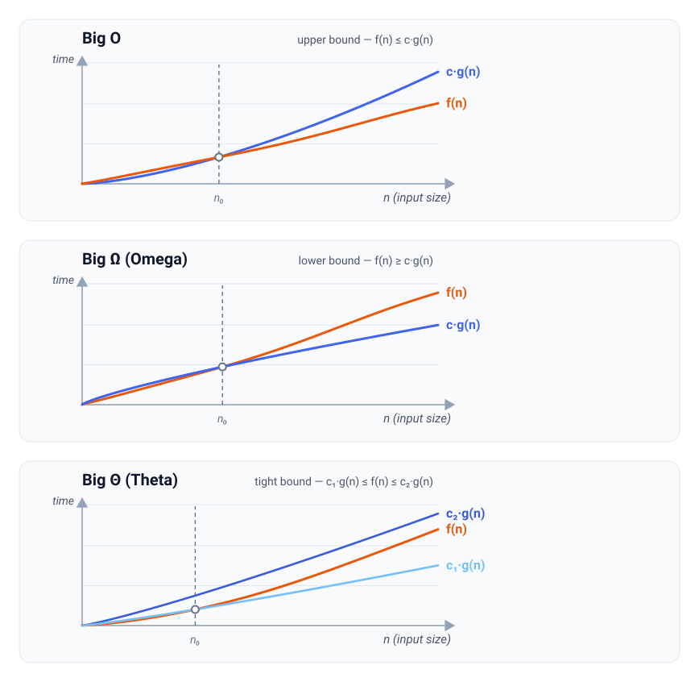
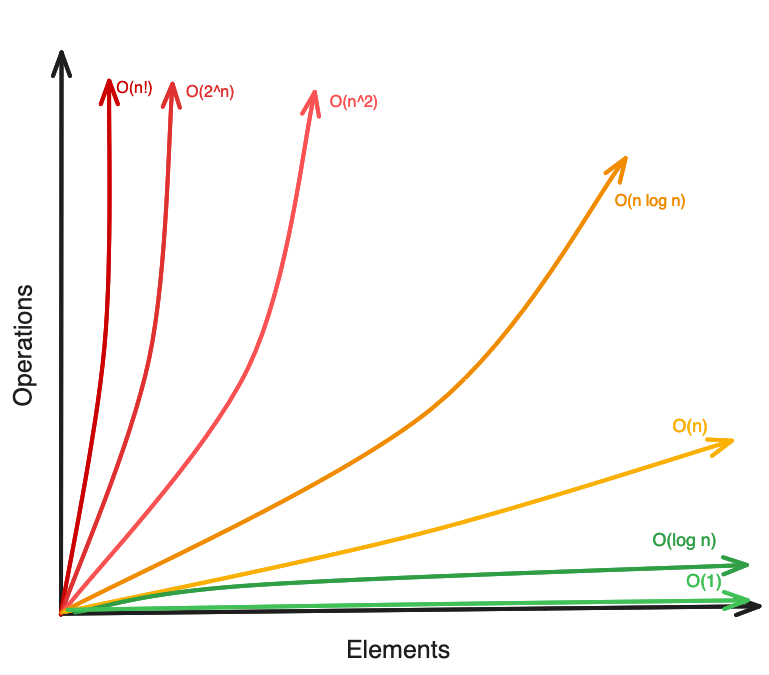

# Asymptotic Analysis

Asymptotic analysis shows how an algorithm's time or space usage scales relative to the input size.

## Bound Notations

An algorithm's exact cost is often a messy expression like `3n^2 + 6`, where `n` is the input size. Carrying every coefficient and constant around is tedious and rarely useful, so instead we use bound notations like O, Ω, and Θ to show that the cost stays *within* a simpler bound as the input grows.

To do that, we compare two functions:

- `f(n)` is the function we are analyzing — the algorithm's actual cost, coefficients and constants included (like `3n^2 + 6`).
- `g(n)` is the simpler reference function we bound it with (`n`, `n^2`, `log n`, ...).

Two constants appear in every definition:

- `c` is a positive constant multiplier we are free to choose. It exists because the notation ignores constant factors.
- `n0` is a threshold. The relationship only has to hold once `n` is large enough, so small-input noise is ignored.

With those pieces in place, each of the three notations bounds `f(n)` from a different direction:

| Notation | Bound | Meaning | Commonly describes |
| --- | --- | --- | --- |
| Big O | Upper bound | `f(n)` grows no faster than `g(n)` | Worst case |
| Big Ω (Omega) | Lower bound | `f(n)` grows no slower than `g(n)` | Best case |
| Big Θ (Theta) | Tight bound | `f(n)` grows exactly like `g(n)` | Average case |



In each graph, `f(n)` is the actual cost / complexity and `c · g(n)` is the scaled reference. Notice the dashed `n0`: the bound only has to hold to its *right*. Left of `n0`, the curves can cross freely — small inputs are ignored.

### Big O (Upper Bound)

Big O says `f(n)` **grows no faster than** `g(n)`.

Formally, `f(n)` stays at or below some constant multiple of `g(n)` once `n` is large enough:

```text
f(n) = O(g(n))   means   f(n) ≤ c · g(n)   for all n ≥ n0
```

So `c · g(n)` acts as a ceiling the cost can never break through past `n0`.

A valid upper bound does not have to be tight.

Example: Linear search is `O(n)`, but it is also technically `O(n^2)`, because `n` also grows no faster than `n^2`. But in practice we quote the *smallest* upper bound we can prove so `O(n)` for linear search.

### Big Omega (Lower Bound)

Big Omega says `f(n)` **grows no slower than** `g(n)`.

It is the same idea with the inequality flipped: `f(n)` stays at or above some constant multiple of `g(n)`:

```text
f(n) = Ω(g(n))   means   f(n) ≥ c · g(n)   for all n ≥ n0
```

So `c · g(n)` acts as a floor the cost never drops below past `n0`.

Lower bounds are how we talk about limits that no algorithm can beat.

Example: Comparison sorting has a lower bound of `Ω(n log n)`, so no comparison sort can be faster than that in the worst case.

### Big Theta (Tight Bound)

Big Theta says `f(n)` **grows exactly like** `g(n)`.

This happens only when `f(n)` is *both* `O(g(n))` and `Ω(g(n))`, so it can be squeezed between two constant multiples of the same `g(n)`:

```text
f(n) = Θ(g(n))   means   c1 · g(n) ≤ f(n) ≤ c2 · g(n)   for all n ≥ n0
```

The cost is sandwiched between a lower multiple `c1 · g(n)` and an upper multiple `c2 · g(n)`. It has the same *shape* as `g(n)`; only the constant is uncertain.

When a tight bound exists, it is the most precise single answer to give a simpler description of a function's complexity.

Example: Merge sort is `Θ(n log n)` because its best and worst cases both do the same work and grow the same way.

## Best, Average, and Worst Case

`n` fixes only the *size* of the input, not its *content*. For the same size, different inputs can cost the same or different amounts. The scenarios we group these inputs into, defined by how favorable they are, are called **cases**. The most common ones are:

- Best case = the cheapest input of size `n`.
- Worst case = the costliest input of size `n`.
- Average case = the average cost across all inputs of size `n`. "Average" always assumes a *distribution* of inputs (here, random order). Change that assumption and the average can change.

So an algorithm does not have one cost per size — it has a *range* of costs, and a deciding a specific case collapses that range into a single function of `n`. Only after a case has been decided for a function can we describe how it performs using a bound notation.

Cases can show the same growth or different growth:

**Same growth in every case** — the cases coincide, so one bound notation can describe all cases. Merge sort is a good example, because it does the same work on every input:

```text
Best case:    Θ(n log n)   always splits in half and merges all n
Average case: Θ(n log n)   input order changes nothing
Worst case:   Θ(n log n)   input order changes nothing
```

Θ(n log n) describes the best, average and worst case.

**Different growth across cases** — the cases split, so no there is no single bound notation to describe all the cases.

Linear search on `n` items depends on where the target sits:

```text
Best case:    Θ(1)   target is the first item
Average case: Θ(n)   target is around the middle on average
Worst case:   Θ(n)   target is missing or last
```

Quicksort depends on how balanced its partitions are:

```text
Best case:    Θ(n log n)   balanced partitions
Average case: Θ(n log n)   random / typical input
Worst case:   Θ(n^2)       sorted input with a poor pivot
```

> **In practice:** When we state an algorithm's *time complexity* or *space complexity*, we usually mean its **worst-case upper bound**. This describes how the algorithm performs in the worst case and gives a function that its resource usage will not grow faster than.

Quicksort is the well-known exception: it is usually quoted by its average `Θ(n log n)`, because a randomized pivot makes the `Θ(n^2)` worst case rare in practice.

## Amortized Analysis

Average case looks at the average cost across the different possible inputs of a single size `n`. Amortized instead looks at a **sequence** of operations on one data structure and finds the average cost *per operation* across that sequence.

It exists because some operations are cheap almost every time but occasionally expensive. Quoting the occasional expensive worst case as the worst case for the algorithm overstates the real cost, so instead we spread the expensive step's cost across all the cheap ones and report the per-operation average.

For self-contained algorithms like comparison sorts (merge sort, quicksort) and searches (binary, linear), amortized analysis **changes nothing** — the amortized cost is just the single-call cost. This is because each call starts fresh: it keeps no state that a later call inherits, so no call is made cheap by earlier ones and no call occasionally spikes because of accumulated state. With every call costing the same, spreading cost across a sequence has nothing to smooth out.

Amortized analysis only helps when operations **share a mutable state** that evolves across the sequence, letting a rare, expensive step pay off many cheap ones.

The classic example is appending to a **dynamic array** (like a Python `list`). The array keeps spare capacity, so most appends just drop the item into an empty slot:

```text
Single append (has spare room):  O(1)
Single append (array is full):   O(n)   copy all n items into a larger buffer
```

Taken alone, the worst case for one append is `O(n)`. But a resize only fires when the array is full, and each resize **doubles** the capacity — so resizes get rarer as the array grows, firing at sizes `1, 2, 4, 8, ...` up to `n`.

Each resize copies every item it currently holds, so its cost equals the size at that moment. Summing only the resize costs across `n` appends gives:

```text
1 + 2 + 4 + 8 + ... + n
```

A doubling series is dominated by its last term — every earlier resize combined (`1 + 2 + ... + n/2 = n - 1`) still costs less than the final resize (`n`) alone — so the whole total is only about `2n`:

```text
1 + 2 + 4 + 8 + ... + n = 2n - 1 ≈ 2n
```

Spreading that `2n` of copying across the `n` appends leaves a constant per append:

```text
Amortized append: O(1)
```

So even though a single append can spike to `O(n)`, any run of `n` appends is guaranteed `O(n)` total.

Besides dynamic-array append, common examples are hash-table insertion (occasional rehash) and incrementing a binary counter (occasional long carry).

## Time and Space Complexity

**Time complexity** is the amount of work an algorithm performs as a function of the input size.

The "work" is usually counted in terms of operations, comparisons, loop iterations, recursive calls, or visited items.

**Space complexity** is the amount of memory an algorithm uses as a function of the input size.

Unless stated otherwise, the memory refers to the *extra memory* used by the algorithm, not the memory already occupied by the input itself. Extra memory includes temporary data structures, copied arrays, recursion stack frames, queues, sets, maps, and similar storage.

To keep things simple, we usually describe an algorithm's time and space complexity using **Big `O`** notation because it gives an upper bound on the cost in the worst case.

In more detailed analysis, we may separately consider best-case, average-case, and worst-case complexity. When the upper and lower bounds match, we may use **Big `Θ`** notation to describe the complexity more tightly.

## Building blocks

### Function Growth rates

Seeing how different Big `O` expression grow makes it easier to judge how one algorithm’s performance scales compared with another algorithm.



| Complexity | Name | Common Meaning | Example |
| --- | --- | --- | --- |
| `O(1)` | Constant | Work does not grow with input size. | Accessing an array/list element by index. |
| `O(log n)` | Logarithmic | Input is repeatedly cut down by a factor. | Binary search. |
| `O(n)` | Linear | Each item is processed once. | Looping through an array/list. |
| `O(n log n)` | Linearithmic / log-linear | Common for efficient comparison sorting. | Merge sort; quicksort average case. |
| `O(n^2)` | Quadratic | Often nested loops over the same input. | Bubble sort; comparing every pair of items. |
| `O(2^n)` | Exponential | Often all subsets or binary choices. | Recursive Fibonacci without memoization. |
| `O(n!)` | Factorial | Often all permutations. | Brute-forcing every route in traveling salesperson. |

### Series Sums in Complexity

The total complexity of an algorithm sometimes comes from the sum of a series.

### Polynomial-Term Series

For a **polynomial-term series**, the final growth given by the sum increases one power from the terms in the series ( From `n^k` to `n^(k+1)` for the sum of the series):

```text
Linear terms (arithmetic progression): 1 + 2 + 3 + ... + n = n(n + 1) / 2 = O(n^2)
Quadratic terms: 1^2 + 2^2 + 3^2 + ... + n^2 = n(n + 1)(2n + 1) / 6 = O(n^3)
Cubic terms: 1^3 + 2^3 + 3^3 + ... + n^3 = [n(n + 1) / 2]^2 = O(n^4)
```

### Geometric Series

For a **geometric progression (GP)** based series, the final growth given by the sum is represented by the same power as the **greatest term**:

**Increasing GP:** The last term is the greatest term and in a GP the greatest term dominates and is greater than the sum of the rest of the terms.

```text
Sum of n-1 terms = 1 + 2 + 4 + ... + 2^(n - 1) = (2^n - 1) / (2 - 1) = 2^n - 1 < 2^n(greatest term)

Sum of n-1 terms = 1 + 3 + 9 + ... + 3^(n - 1) = (3^n - 1) / (3 - 1) = (3^n - 1) / 2 < 3^n(greatest term)

Sum of n-1 terms = 1 + 5 + 25 + ... + 5^(n - 1) = (5^n - 1) / (5 - 1) = (5^n - 1) / 4 < 5^n(greatest term)
```

That is why for an increasing GP of n terms:

```text
1 + 2 + 4 + ... + 2^n = (2^(n + 1) - 1) / (2 - 1) = 2^(n + 1) - 1 = 2 * 2^n - 1 = O(2^n)

1 + 3 + 9 + ... + 3^n = (3^(n + 1) - 1) / (3 - 1) = (3 * 3^n - 1) / 2 = O(3^n)

1 + 5 + 25 + ... + 5^n = (5^(n + 1) - 1) / (5 - 1) = (5 * 5^n - 1) / 4 = O(5^n)

```

Although the complexity could also be written with shifted exponent forms like `O(2^(n - 1))` or `O(2^(n + 1))`, the cleanest way is `O(2^n)` because it describes that the sum is essentially a constant multiple of the greatest term, `2^n`.

**Decreasing GP:** The first term is the greatest term and in a GP the greatest term dominates and is greater than the sum of the rest of the terms.

```text
Sum of remaining terms = n/2 + n/4 + ... + 1 = n(1/2 + 1/4 + ... + 1/2^k), where n = 2^k
                       = n((1/2)(1 - (1/2)^k) / (1 - 1/2)) = n(1 - 1/n) = n - 1 < n(greatest term)

Sum of remaining terms = n/3 + n/9 + ... + 1 = n(1/3 + 1/9 + ... + 1/3^k), where n = 3^k
                       = n((1/3)(1 - (1/3)^k) / (1 - 1/3)) = n((1 - 1/n) / 2) = (n - 1) / 2 < n(greatest term)

Sum of remaining terms = n/5 + n/25 + ... + 1 = n(1/5 + 1/25 + ... + 1/5^k), where n = 5^k
                       = n((1/5)(1 - (1/5)^k) / (1 - 1/5)) = n((1 - 1/n) / 4) = (n - 1) / 4 < n(greatest term)
```

That is why for a decreasing GP starting from n:

```text
n + n/2 + n/4 + ... + 1 = n + (n - 1) = 2n - 1 = O(n)

n + n/3 + n/9 + ... + 1 = n + (n - 1) / 2 = (3n - 1) / 2 = O(n)

n + n/5 + n/25 + ... + 1 = n + (n - 1) / 4 = (5n - 1) / 4 = O(n)
```

Although the complexity could also be written with constant multiple forms like `O(2n)`, `O(3n/2)`, or `O(5n/4)`, the cleanest way is `O(n)` because it describes that the sum is essentially a constant multiple of the greatest term, `n`.

### Input Shape Matters

### Input Shape Matters

Complexity is expressed as a function of input size, but “input size” does not always mean `n` items in a list. The right variables depend on the shape of the input and the part of the structure the algorithm must process.

Common input-size measures include:

```text
List with n items:                  O(n)
Tree with N nodes:                  O(N)
Graph with V vertices, E edges:     O(V + E)
Grid with R rows, C columns:        O(R * C)
Search tree depth n:                O(b^n)
```

The standardized tables below use:

- `n` for the number of items in a linear input.
- `N` for the number of nodes in a tree.
- `V` and `E` for graph vertices and edges.
- `R` and `C` for grid rows and columns.
- `k` for an extra input constraint such as a value range, bucket count, digit count, or number of passes.
- `h` for tree height.
- `b` for branching factor.

## Algorithms

Algorithms come first because they describe a procedure independent of a particular abstract data type. Searching and traversal algorithms are grouped before sorting algorithms.

### Search Algorithms

Use rendered Markdown tables for these comparison summaries. They stay searchable and easy to edit, while the implementation details can live in the dedicated algorithm notes.

#### List Search Algorithms

| Algorithm | Input requirement | Search goal | Best case | Average case | Worst case | Extra space | When to use |
| --- | --- | --- | --- | --- | --- | --- | --- |
| Linear Search | Any list | Find target by checking each item | `Θ(1)` | `Θ(n)` | `Θ(n)` | `Θ(1)` | Unsorted data, tiny lists, or one-off searches where sorting first is not worth it. |
| Binary Search | Sorted random-access list | Find exact target or boundary position | `Θ(1)` | `Θ(log n)` | `Θ(log n)` | `Θ(1)` iterative | Default choice for sorted lists and monotonic search conditions. |
| Jump Search | Sorted random-access list | Jump by blocks, then scan inside one block | `Θ(1)` | `Θ(√n)` | `Θ(√n)` | `Θ(1)` | Mostly a comparison point; useful when block jumps are cheap but random probing is less ideal. |
| Interpolation Search | Sorted numeric list with roughly uniform values | Estimate target position from value distribution | `Θ(1)` | `Θ(log log n)` | `Θ(n)` | `Θ(1)` | Numeric keys that are evenly spread, like IDs distributed across a known range. |
| Exponential Search | Sorted list, especially unbounded or unknown length | Find a range by doubling, then binary search inside it | `Θ(1)` | `Θ(log i)` | `Θ(log n)` | `Θ(1)` iterative | Sorted streams, unknown-size arrays, or cases where the target may be close to the front. |

`i` is the target's index when the target exists. If the target is missing, use `n` as the list size.

How to remember the group:

- If the list is not sorted, think **linear search**.
- If the list is sorted, think **binary search** first.
- If the list is sorted but its length is unknown, think **exponential search**.
- If the list is sorted, numeric, and evenly distributed, **interpolation search** can beat binary search on average but loses its advantage when the data is clustered.
- **Jump search** sits between linear search and binary search conceptually.

#### Linear Search

Linear search checks items one by one until it finds the target or exhausts the input.

| Complexity Type | Best Case | Average Case | Worst Case |
| --- | --- | --- | --- |
| Time | `Θ(1)` | `Θ(n)` | `Θ(n)` |
| Space | `Θ(1)` | `Θ(1)` | `Θ(1)` |

**Why Θ:** For each case, the lower and upper bounds match. The best case checks the first item, the average case checks a linear number of items under the usual random-position assumption, and the worst case checks all `n` items. The algorithm uses only constant extra memory in every case.

#### Binary Search

| Complexity Type | Best Case | Average Case | Worst Case |
| --- | --- | --- | --- |
| Time |  |  |  |
| Space |  |  |  |

**Note:** Requires sorted input.

#### Tree BFS

| Complexity Type | Best Case | Average Case | Worst Case |
| --- | --- | --- | --- |
| Time |  |  |  |
| Space |  |  |  |

#### Tree DFS

| Complexity Type | Best Case | Average Case | Worst Case |
| --- | --- | --- | --- |
| Time |  |  |  |
| Space |  |  |  |

#### Binary Search Tree Search

| Complexity Type | Best Case | Average Case | Worst Case |
| --- | --- | --- | --- |
| Time |  |  |  |
| Space |  |  |  |

**Note:** The time depends on tree height `h`; balanced and skewed trees should be called out when this entry is filled.

#### Graph BFS

| Complexity Type | Best Case | Average Case | Worst Case |
| --- | --- | --- | --- |
| Time |  |  |  |
| Space |  |  |  |

#### Graph DFS

| Complexity Type | Best Case | Average Case | Worst Case |
| --- | --- | --- | --- |
| Time |  |  |  |
| Space |  |  |  |

#### Grid Traversal

| Complexity Type | Best Case | Average Case | Worst Case |
| --- | --- | --- | --- |
| Time |  |  |  |
| Space |  |  |  |

#### Backtracking Over a Decision Tree

| Complexity Type | Best Case | Average Case | Worst Case |
| --- | --- | --- | --- |
| Time |  |  |  |
| Space |  |  |  |

**Note:** Count output space separately when the algorithm stores every valid solution.

### Comparison Sort Algorithms

Comparison sorting usually has a worst-case lower bound of:

```text
Ω(n log n)
```

That means algorithms like merge sort and heap sort are asymptotically optimal among comparison sorts in the worst case.

| Algorithm | Main idea | Best case | Average case | Worst case | Extra space | Stable? | In-place? | Memory hook |
| --- | --- | --- | --- | --- | --- | --- | --- | --- |
| Bubble Sort | Repeatedly swap adjacent inverted pairs so large values move right. | `Θ(n)` optimized, `Θ(n^2)` plain | `Θ(n^2)` | `Θ(n^2)` | `Θ(1)` | Yes | Yes | Largest item bubbles to the end each pass. |
| Selection Sort | Repeatedly select the smallest remaining value and place it next. | `Θ(n^2)` | `Θ(n^2)` | `Θ(n^2)` | `Θ(1)` | No | Yes | Select the next minimum; few swaps, many comparisons. |
| Insertion Sort | Grow a sorted prefix by inserting each new key into position. | `Θ(n)` | `Θ(n^2)` | `Θ(n^2)` | `Θ(1)` | Yes | Yes | Works like sorting cards in your hand. |
| Merge Sort | Split the list, sort each half, then merge sorted halves. | `Θ(n log n)` | `Θ(n log n)` | `Θ(n log n)` | `Θ(n)` | Yes | No for typical arrays | Predictable optimal comparison sort. |
| Quick Sort | Partition around a pivot, then recursively sort each side. | `Θ(n log n)` | `Θ(n log n)` | `Θ(n^2)` | `Θ(log n)` average stack | Usually no | Usually yes | Fast in practice, but bad pivots create the worst case. |
| Heap Sort | Build a max heap, then repeatedly move the max to the end. | `Θ(n log n)` | `Θ(n log n)` | `Θ(n log n)` | `Θ(1)` | No | Yes | Turns the list into a heap, then extracts the maximum repeatedly. |

Stable means equal values keep their original relative order. In-place means the algorithm uses constant extra list storage, not counting the input list itself. The quick sort row describes the common in-place partition version; a version that builds separate `left`, `middle`, and `right` lists is not in-place.

### Bubble Sort

| Complexity Type | Best Case | Average Case | Worst Case |
| --- | --- | --- | --- |
| Time |  |  |  |
| Space |  |  |  |

**Note:** Distinguish optimized bubble sort with an early-exit flag from the unoptimized version.

### Selection Sort

| Complexity Type | Best Case | Average Case | Worst Case |
| --- | --- | --- | --- |
| Time |  |  |  |
| Space |  |  |  |

### Insertion Sort

| Complexity Type | Best Case | Average Case | Worst Case |
| --- | --- | --- | --- |
| Time |  |  |  |
| Space |  |  |  |

### Merge Sort

| Complexity Type | Best Case | Average Case | Worst Case |
| --- | --- | --- | --- |
| Time |  |  |  |
| Space |  |  |  |

### Quick Sort

| Complexity Type | Best Case | Average Case | Worst Case |
| --- | --- | --- | --- |
| Time |  |  |  |
| Space |  |  |  |

**Note:** Average-case complexity is often the headline result, but the worst case should still be shown.

### Heap Sort

| Complexity Type | Best Case | Average Case | Worst Case |
| --- | --- | --- | --- |
| Time |  |  |  |
| Space |  |  |  |

### Non Comparison Sort Algorithm

#### Bucket Sort

| Complexity Type | Best Case | Average Case | Worst Case |
| --- | --- | --- | --- |
| Time |  |  |  |
| Space |  |  |  |

**Note:** Define what `k` means before filling this entry.

#### Counting Sort

| Complexity Type | Best Case | Average Case | Worst Case |
| --- | --- | --- | --- |
| Time |  |  |  |
| Space |  |  |  |

**Note:** Here `k` usually means the value range.

#### Radix Sort

| Complexity Type | Best Case | Average Case | Worst Case |
| --- | --- | --- | --- |
| Time |  |  |  |
| Space |  |  |  |

**Note:** Here `k` usually means the number of digits or passes.

#### Tim Sort

| Complexity Type | Best Case | Average Case | Worst Case |
| --- | --- | --- | --- |
| Time |  |  |  |
| Space |  |  |  |

#### Shell Sort

| Complexity Type | Best Case | Average Case | Worst Case |
| --- | --- | --- | --- |
| Time |  |  |  |
| Space |  |  |  |

## Data Structures

Data structures come after algorithms because each structure needs separate entries for its operation axes. The standard axes from the data-structure reference table are:

- Access.
- Search.
- Insertion.
- Deletion.

For each data structure, fill the operation axes one by one using the same table format. If the data structure also needs an overall storage entry, add a `Storage` axis and mark the time cells as `N/A`.

### Array

### Access

| Complexity Type | Best Case | Average Case | Worst Case |
| --- | --- | --- | --- |
| Time |  |  |  |
| Space |  |  |  |

### Search

| Complexity Type | Best Case | Average Case | Worst Case |
| --- | --- | --- | --- |
| Time |  |  |  |
| Space |  |  |  |

### Insertion

| Complexity Type | Best Case | Average Case | Worst Case |
| --- | --- | --- | --- |
| Time |  |  |  |
| Space |  |  |  |

### Deletion

| Complexity Type | Best Case | Average Case | Worst Case |
| --- | --- | --- | --- |
| Time |  |  |  |
| Space |  |  |  |

### Stack

### Access

| Complexity Type | Best Case | Average Case | Worst Case |
| --- | --- | --- | --- |
| Time |  |  |  |
| Space |  |  |  |

### Search

| Complexity Type | Best Case | Average Case | Worst Case |
| --- | --- | --- | --- |
| Time |  |  |  |
| Space |  |  |  |

### Insertion

| Complexity Type | Best Case | Average Case | Worst Case |
| --- | --- | --- | --- |
| Time |  |  |  |
| Space |  |  |  |

### Deletion

| Complexity Type | Best Case | Average Case | Worst Case |
| --- | --- | --- | --- |
| Time |  |  |  |
| Space |  |  |  |

### Queue

### Access

| Complexity Type | Best Case | Average Case | Worst Case |
| --- | --- | --- | --- |
| Time |  |  |  |
| Space |  |  |  |

### Search

| Complexity Type | Best Case | Average Case | Worst Case |
| --- | --- | --- | --- |
| Time |  |  |  |
| Space |  |  |  |

### Insertion

| Complexity Type | Best Case | Average Case | Worst Case |
| --- | --- | --- | --- |
| Time |  |  |  |
| Space |  |  |  |

### Deletion

| Complexity Type | Best Case | Average Case | Worst Case |
| --- | --- | --- | --- |
| Time |  |  |  |
| Space |  |  |  |

### Singly Linked List

### Access

| Complexity Type | Best Case | Average Case | Worst Case |
| --- | --- | --- | --- |
| Time |  |  |  |
| Space |  |  |  |

### Search

| Complexity Type | Best Case | Average Case | Worst Case |
| --- | --- | --- | --- |
| Time |  |  |  |
| Space |  |  |  |

### Insertion

| Complexity Type | Best Case | Average Case | Worst Case |
| --- | --- | --- | --- |
| Time |  |  |  |
| Space |  |  |  |

### Deletion

| Complexity Type | Best Case | Average Case | Worst Case |
| --- | --- | --- | --- |
| Time |  |  |  |
| Space |  |  |  |

### Doubly Linked List

### Access

| Complexity Type | Best Case | Average Case | Worst Case |
| --- | --- | --- | --- |
| Time |  |  |  |
| Space |  |  |  |

### Search

| Complexity Type | Best Case | Average Case | Worst Case |
| --- | --- | --- | --- |
| Time |  |  |  |
| Space |  |  |  |

### Insertion

| Complexity Type | Best Case | Average Case | Worst Case |
| --- | --- | --- | --- |
| Time |  |  |  |
| Space |  |  |  |

### Deletion

| Complexity Type | Best Case | Average Case | Worst Case |
| --- | --- | --- | --- |
| Time |  |  |  |
| Space |  |  |  |

### Skip List

### Access

| Complexity Type | Best Case | Average Case | Worst Case |
| --- | --- | --- | --- |
| Time |  |  |  |
| Space |  |  |  |

### Search

| Complexity Type | Best Case | Average Case | Worst Case |
| --- | --- | --- | --- |
| Time |  |  |  |
| Space |  |  |  |

### Insertion

| Complexity Type | Best Case | Average Case | Worst Case |
| --- | --- | --- | --- |
| Time |  |  |  |
| Space |  |  |  |

### Deletion

| Complexity Type | Best Case | Average Case | Worst Case |
| --- | --- | --- | --- |
| Time |  |  |  |
| Space |  |  |  |

### Hash Table

### Access

| Complexity Type | Best Case | Average Case | Worst Case |
| --- | --- | --- | --- |
| Time |  |  |  |
| Space |  |  |  |

**Note:** Use `N/A` when direct index-style access is not a meaningful operation.

### Search

| Complexity Type | Best Case | Average Case | Worst Case |
| --- | --- | --- | --- |
| Time |  |  |  |
| Space |  |  |  |

### Insertion

| Complexity Type | Best Case | Average Case | Worst Case |
| --- | --- | --- | --- |
| Time |  |  |  |
| Space |  |  |  |

### Deletion

| Complexity Type | Best Case | Average Case | Worst Case |
| --- | --- | --- | --- |
| Time |  |  |  |
| Space |  |  |  |

### Binary Search Tree

### Access

| Complexity Type | Best Case | Average Case | Worst Case |
| --- | --- | --- | --- |
| Time |  |  |  |
| Space |  |  |  |

### Search

| Complexity Type | Best Case | Average Case | Worst Case |
| --- | --- | --- | --- |
| Time |  |  |  |
| Space |  |  |  |

### Insertion

| Complexity Type | Best Case | Average Case | Worst Case |
| --- | --- | --- | --- |
| Time |  |  |  |
| Space |  |  |  |

### Deletion

| Complexity Type | Best Case | Average Case | Worst Case |
| --- | --- | --- | --- |
| Time |  |  |  |
| Space |  |  |  |

### Cartesian Tree

### Access

| Complexity Type | Best Case | Average Case | Worst Case |
| --- | --- | --- | --- |
| Time |  |  |  |
| Space |  |  |  |

**Note:** Use `N/A` when direct index-style access is not a meaningful operation.

### Search

| Complexity Type | Best Case | Average Case | Worst Case |
| --- | --- | --- | --- |
| Time |  |  |  |
| Space |  |  |  |

### Insertion

| Complexity Type | Best Case | Average Case | Worst Case |
| --- | --- | --- | --- |
| Time |  |  |  |
| Space |  |  |  |

### Deletion

| Complexity Type | Best Case | Average Case | Worst Case |
| --- | --- | --- | --- |
| Time |  |  |  |
| Space |  |  |  |

### B-Tree

### Access

| Complexity Type | Best Case | Average Case | Worst Case |
| --- | --- | --- | --- |
| Time |  |  |  |
| Space |  |  |  |

### Search

| Complexity Type | Best Case | Average Case | Worst Case |
| --- | --- | --- | --- |
| Time |  |  |  |
| Space |  |  |  |

### Insertion

| Complexity Type | Best Case | Average Case | Worst Case |
| --- | --- | --- | --- |
| Time |  |  |  |
| Space |  |  |  |

### Deletion

| Complexity Type | Best Case | Average Case | Worst Case |
| --- | --- | --- | --- |
| Time |  |  |  |
| Space |  |  |  |

### Red-Black Tree

### Access

| Complexity Type | Best Case | Average Case | Worst Case |
| --- | --- | --- | --- |
| Time |  |  |  |
| Space |  |  |  |

### Search

| Complexity Type | Best Case | Average Case | Worst Case |
| --- | --- | --- | --- |
| Time |  |  |  |
| Space |  |  |  |

### Insertion

| Complexity Type | Best Case | Average Case | Worst Case |
| --- | --- | --- | --- |
| Time |  |  |  |
| Space |  |  |  |

### Deletion

| Complexity Type | Best Case | Average Case | Worst Case |
| --- | --- | --- | --- |
| Time |  |  |  |
| Space |  |  |  |

### Splay Tree

### Access

| Complexity Type | Best Case | Average Case | Worst Case |
| --- | --- | --- | --- |
| Time |  |  |  |
| Space |  |  |  |

**Note:** Use `N/A` when direct index-style access is not a meaningful operation.

### Search

| Complexity Type | Best Case | Average Case | Worst Case |
| --- | --- | --- | --- |
| Time |  |  |  |
| Space |  |  |  |

### Insertion

| Complexity Type | Best Case | Average Case | Worst Case |
| --- | --- | --- | --- |
| Time |  |  |  |
| Space |  |  |  |

### Deletion

| Complexity Type | Best Case | Average Case | Worst Case |
| --- | --- | --- | --- |
| Time |  |  |  |
| Space |  |  |  |

### AVL Tree

### Access

| Complexity Type | Best Case | Average Case | Worst Case |
| --- | --- | --- | --- |
| Time |  |  |  |
| Space |  |  |  |

### Search

| Complexity Type | Best Case | Average Case | Worst Case |
| --- | --- | --- | --- |
| Time |  |  |  |
| Space |  |  |  |

### Insertion

| Complexity Type | Best Case | Average Case | Worst Case |
| --- | --- | --- | --- |
| Time |  |  |  |
| Space |  |  |  |

### Deletion

| Complexity Type | Best Case | Average Case | Worst Case |
| --- | --- | --- | --- |
| Time |  |  |  |
| Space |  |  |  |

### KD Tree

### Access

| Complexity Type | Best Case | Average Case | Worst Case |
| --- | --- | --- | --- |
| Time |  |  |  |
| Space |  |  |  |

### Search

| Complexity Type | Best Case | Average Case | Worst Case |
| --- | --- | --- | --- |
| Time |  |  |  |
| Space |  |  |  |

### Insertion

| Complexity Type | Best Case | Average Case | Worst Case |
| --- | --- | --- | --- |
| Time |  |  |  |
| Space |  |  |  |

### Deletion

| Complexity Type | Best Case | Average Case | Worst Case |
| --- | --- | --- | --- |
| Time |  |  |  |
| Space |  |  |  |
