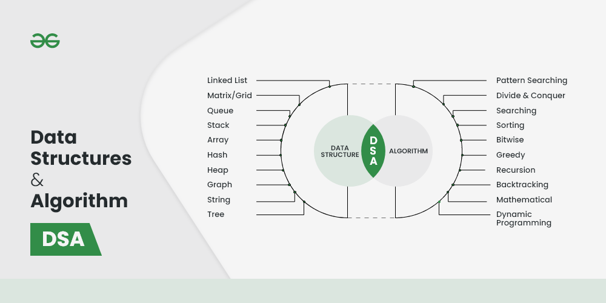
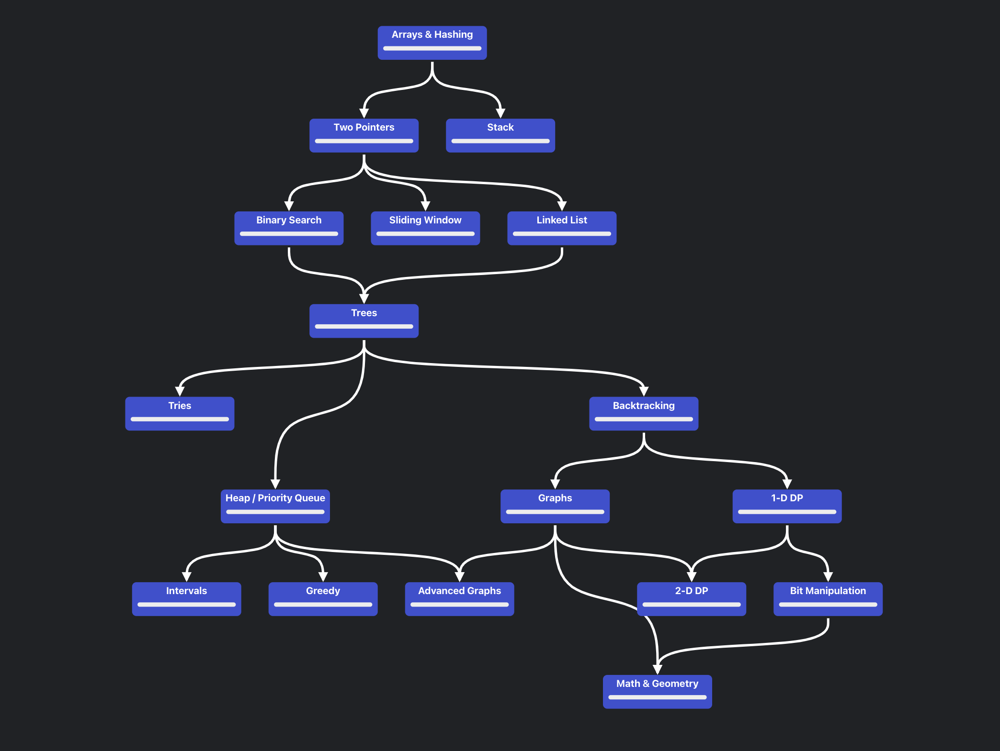
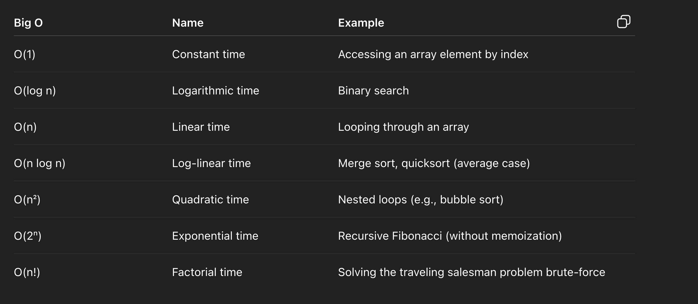
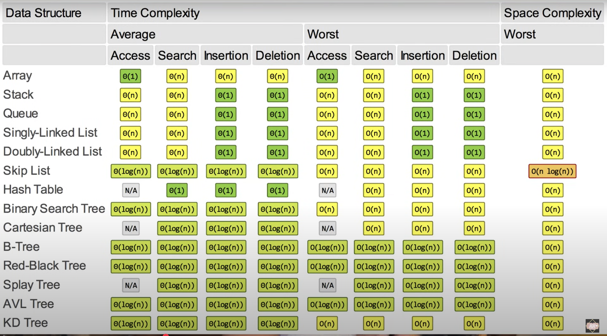
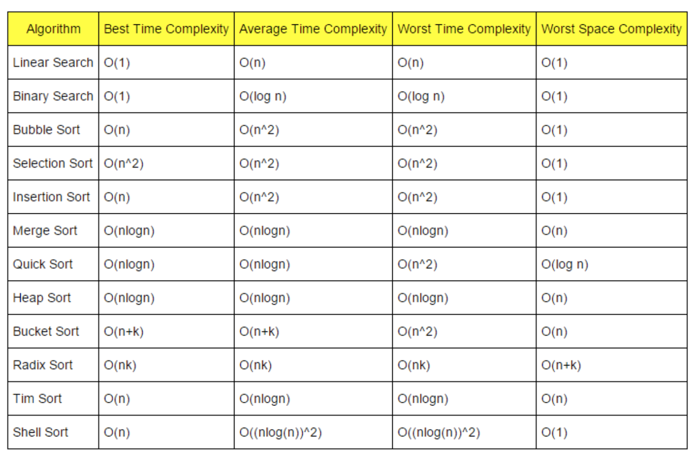

# Conceptual Notes



---

## Study Roadmap



## BIG-O

Big O notation is a way to describe how efficient an algorithm is. It tells you how performance scales as input size grows (usually represented as O()) especially in terms of:

- Time (how long it takes to run),
- Space (how much memory it uses).



## Common Data Structures

### Trees

#### Binary Tree

Each node has at most 2 children.

#### Complete Binary Tree

All levels of the tree are filled from left to right, except maybe the last level.

#### Binary Search Tree (BST)

A Binary Tree that holds the following ordering property:

```text
Left Child < Parent < Right Child
```

#### AVL Tree

A self balancing BST, that employs rotations to ensure that the Balance factor is at most 1 in magnitude for every node. Balance factor is the difference in height of left and right child.

Performs insertion and deletion in O(log n) time. Learn about specifics of rotation from 341-Project 2 Notes.

#### Splay Tree

A BST in which we store the most recently accessed node as the root of the tree.

### Heaps

#### Heap Structure

An implementation of a priority queue ADT (Abstract Data Type), where elements are arranged and accessed based on their priority (and not order of insertion or such). Usually a complete binary Tree that follows the Heap Property.

**Heap Property:**

- **Min Heap:** Parent value < Left and Right Child value. In this case we mean to say that lesser value means a higher priority. So, the function that calculates that priority value is designed differently.
- **Max Heap:** Parent value > Left and Right Child value. In this case we mean to say that greater value means a higher priority. So, the function that calculates that priority value is designed differently.

#### Skew Heap

A binary tree whose root always hold the highest priority. Skew Heap uses merge operation to perform insertion and deletion.

Performs insertion and deletion in O(log n) time.

#### Leftist Heap

A special Skew Heap, in which each node stores the Null Path Length (NPL).

NPL is the minimum number of edges from the node to a descendant node that has a null child (i.e. fewer than 2 children).

In leftist heap, if the NPL value of a right child is larger than the left child, we swap the children (To make a Left heavy tree in a sense).

### Hash Table

## Complexity of Data Structures



## Sorting Algorithms (Increasing Order of Efficiency)

### 1. Bubble Sort

**Time Complexity:**

- Best-case: O(n²) (For normal version) OR O(n) (For modified version using swap flag, in the case the list is already sorted and optimized)
- Average-case: O(n²)
- Worst-case: O(n²)

**Space Complexity:** O(1) (In-place sorting)

### 2. Selection Sort

**Time Complexity:**

- Best-case: O(n²)
- Average-case: O(n²)
- Worst-case: O(n²)

**Space Complexity:** O(1) (In-place sorting)

### 3. Insertion Sort

**Time Complexity:**

- Best-case: O(n) (if the list is already sorted, since the inner loops breaks right in the beginning each time)
- Average-case: O(n²)
- Worst-case: O(n²)

**Space Complexity:** O(1) (In-place sorting)

### 4. Merge Sort

**Time Complexity:**

- Best-case: O(n log n)
- Average-case: O(n log n)
- Worst-case: O(n log n)

**Space Complexity:** O(n) (requires additional space for merging)

### 5. Quick Sort

**Time Complexity:**

- Best-case: O(n log n)
- Average-case: O(n log n)
- Worst-case: O(n²) (if the pivot is poorly chosen)

**Space Complexity:** O(log n) (in-place, but recursive calls require space)

### 6. Heap Sort

**Time Complexity:**

- Best-case: O(n log n)
- Average-case: O(n log n)
- Worst-case: O(n log n)

**Space Complexity:** O(1) (In-place sorting)

### 7. Radix Sort (Non-comparative)

**Time Complexity:**

- Best-case: O(nk)
- Average-case: O(nk)
- Worst-case: O(nk), where k is the number of digits in the largest number

**Space Complexity:** O(n + k) (due to auxiliary storage)

### 8. Counting Sort (Non-comparative)

**Time Complexity:**

- Best-case: O(n + k)
- Average-case: O(n + k)
- Worst-case: O(n + k), where k is the range of the input values

**Space Complexity:** O(k) (due to auxiliary space for counting occurrences)

### 9. Tim Sort (Hybrid of Merge Sort and Insertion Sort)

**Time Complexity:**

- Best-case: O(n)
- Average-case: O(n log n)
- Worst-case: O(n log n)

**Space Complexity:** O(n) (due to auxiliary space for merging)

### Complexity Reference Table



---

## Search Algorithms

### 1. Linear Search

- **Use Case:** Unsorted list
- **Time Complexity:** O(n)

### 2. Binary Search

- **Use Case:** Sorted list
- **Time Complexity:** O(log n)

### 3. Greedy Search

Greedy Search is a search algorithm used in pathfinding and optimization problems. It makes decisions by always choosing the option that seems best at the moment, hoping this leads to a globally optimal solution.

- **Not optimal:** Because it doesn't consider the full path cost, it can get stuck in local optima and might not find the best solution.
- **Not complete:** If the search space is infinite, it might not terminate.
- **Use Case:** _(not specified in source)_
- **Time Complexity:** _(not specified in source)_

### 4. A* Search

- **Use Case:** _(not specified in source)_
- **Time Complexity:** _(not specified in source)_

---
