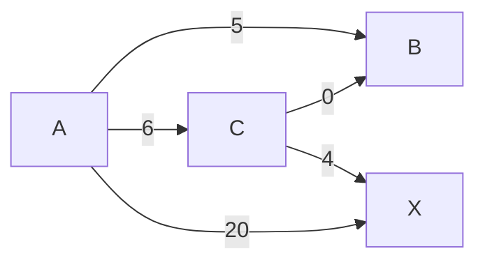

# Dijkstra's Algorithm

Dijkstra's algorithm finds the shortest path from one source node to every other reachable node in a weighted graph with non-negative edges.

## Core Idea

- Keep the best known distance to each node in `distances`. Start the source at `0` and every other node at `infinity`.
- Keep a min-heap of `(distance, node)` candidates, initialized to `[(0, source)]`. It always hands back the cheapest route that has been discovered but not yet explored.
- Pop the cheapest candidate, `(current_distance, current_node)`. That distance is final, and the node is now **settled**.
- **Relax** every edge out of the settled node. Relaxing an edge means testing whether routing through the settled node gives its neighbour a shorter route than the one already recorded, and taking the shorter one if so(Relaxing as in lowering the supposed distance). For an edge `current_node -> v` with weight `w`: if `current_distance + w < distances[v]`, update `distances[v]` and push `(distances[v], v)` onto the heap.
- A node is pushed once per improvement, so the heap can hold several entries for it. Only its first pop settles it; later entries are **stale** and are skipped.
- Stop when the heap is empty. Any node still at `infinity` is unreachable from the source.

### Why the Popped Distance Is Final

`current_distance` is the smallest distance in the heap, and any unsettled node can only be reached through a node sitting in the heap.

Take any other path from the source to `current_node`. Somewhere along it the path steps from a settled node to an unsettled one; call that node `y`. Because `y` was reached by relaxing an edge out of a settled node, `y` is already in the heap, so its distance is at least `current_distance`. The remainder of the path from `y` onward only adds non-negative weight. The whole path therefore costs at least `current_distance` and cannot improve on it.

The argument depends entirely on weights being non-negative. One negative edge would let a later path subtract from an already-larger distance and undercut a node that had been settled, which is why [Bellman-Ford](Bellman%20Ford%20Algorithm.md) is needed there instead.

### Stale Heap Entries

A cheaper route to a node can turn up after a worse one was already queued. Rather than search the heap and update the old entry, the old entry is left alone and discarded on pop: if `current_distance > distances[current_node]`, a better route already settled that node, so skip it without relaxing its edges. This is what makes a node's edges get relaxed exactly once.

Source is `A`:



| Popped | What happens | `distances` (A, B, C, X) | Heap after |
| --- | --- | --- | --- |
| — | Initial state | 0, inf, inf, inf | `(0, A)` |
| `(0, A)` | `A->B`, `A->C` and `A->X` all improve on `infinity` | 0, 5, 6, 20 | `(5, B)`, `(6, C)`, `(20, X)` |
| `(5, B)` | `B` settles at 5; it has no outgoing edges | 0, 5, 6, 20 | `(6, C)`, `(20, X)` |
| `(6, C)` | `C->B` gives `6 + 0 = 6`, no better than 5. `C->X` gives `6 + 4 = 10`, better than 20 | 0, 5, 6, 10 | `(10, X)`, `(20, X)` |
| `(10, X)` | Matches `distances[X]`, so `X` settles at 10 | 0, 5, 6, 10 | `(20, X)` |
| `(20, X)` | `20 > 10`, stale. Skipped, so `X`'s edges are never relaxed a second time | 0, 5, 6, 10 | empty |

`X` was queued at 20 before the cheaper route through `C` existed, and both of its entries stayed in the heap until popped.

## When to Use

- Use for graphs with non-negative edge weights. If the graph has negative edge weights, use Bellman-Ford instead.
- Works on both directed graphs and undirected graphs.
- Use an adjacency list plus a min-heap for efficient implementation.

## Directed vs Undirected Graphs

- In a directed graph, each edge only relaxes in its stored direction: `A -> B`.
- In an undirected graph, treat each edge as two directed edges: `A -> B` and `B -> A`.

## Implementation

```python
import heapq

# graph is an adjancency list where graph[node] = List of (neighbour, weight)
def dijkstra(graph, source):
    # distances[node] is distance from source node
    distances = {node: float("inf") for node in graph}
    distances[source] = 0

    min_heap = [(0, source)]

    while min_heap:
        current_distance, current_node = heapq.heappop(min_heap)

        # From en earlier iteration, we have a shorter distance for reaching `current_node` 
        # So there is no point in considering the prospect of reaching current_node 
        # from this larger distance and further explore it's neighbours
        # This makes it so that a node's neighbours are only explored once, when it is popped from the heap as the smallest distance from source to that node
        if current_distance > distances[current_node]:
            continue

        for neighbor, weight in graph[current_node]:
            # Relaxing the edge
            new_distance = current_distance + weight
            # If this new_distance from source to this neighbour is lesser than our recorded distance for the neigbour
            if new_distance < distances[neighbor]:
                # Update the smallest distance to this neighbour node
                distances[neighbor] = new_distance 
                # Add this reachable neighbour node and its shortest distance from source in min_heap
                heapq.heappush(min_heap, (new_distance, neighbor)) 

    return distances
```

## Complexity

- **Time: `O(V + E log V)`**

  - Initializing distances takes `O(V)`.
  - Each edge is examined once, from a settled node to its neighbour.
  - Each successful relaxation adds an entry to the heap, giving at most `O(E)` pushes and pops.
  - The heap holds at most `O(E)` entries, so each push or pop costs `O(log E)`, giving `O(E log E)` overall.
  - For a simple graph, `E = O(V²)`, so `log E = O(log V)`. Thus, the total time complexity is `O(V + E log V)`.

- Space: `O(V)` for distances and heap state, plus the graph storage.
