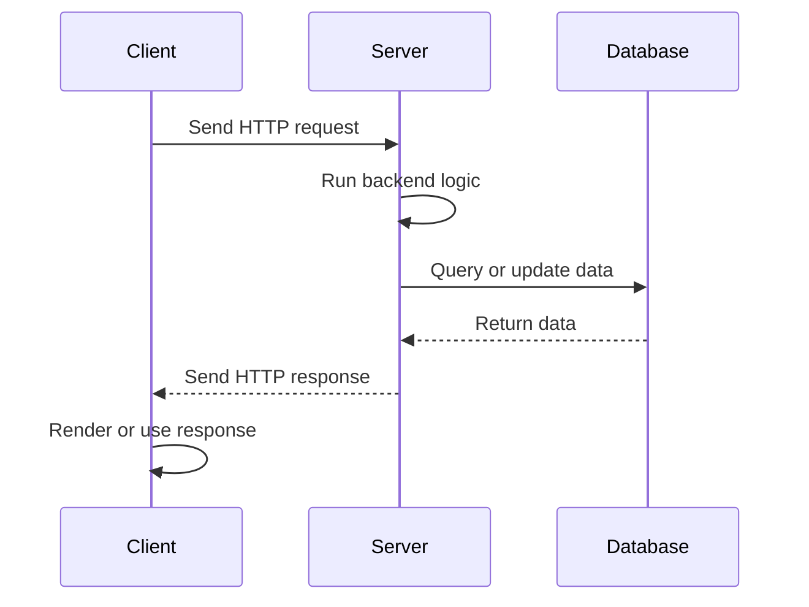
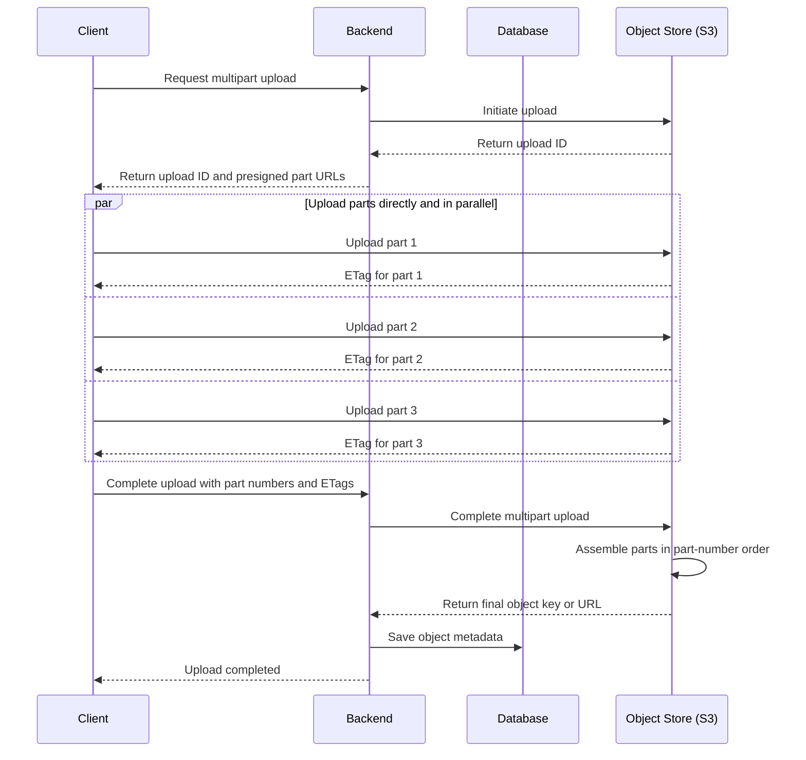

# Terminology

## Languages and Frameworks

### Backend Programming Language

Backend Programming Language enable computers to be turned into servers. They let you write all sorts of logic in the backend.

Popular Languages:

1. Python
2. Typescript/Javascscript: Enabled by NodeJS to run outside of a browser
3. Java

### Package/Library

A code distribution written by someone else that can be installed and used in your project. It usually contains functions, classes or tools that give us additional functionality like access to use-case-specific data type, calculation features, talking to a database and setting up user authentication and login.

### Package Manager

A package manager installs, updates, and removes software together with its dependencies. They could be Operating-System(OS) level or Language Level.

#### OS Level

OS-level package managers install software used by the operating system or by multiple users and projects. This can include installing CLI tools, desktop applications, system libraries, services, compilers, and language runtimes.

Examples of OS level package managers:

| Operating System | Package Manager |
|---|---|
| Debian/Ubuntu Linux | `apt` |
| Fedora/RHEL Linux | `dnf` |
| Arch Linux | `pacman` |
| macOS | Homebrew |
| Windows | `winget` / Chocolatey |

For example, a system package manager might install Python, Node.js, Java, Git, PostgreSQL, or a shared C library. Packages are commonly installed into system-managed directories and may require administrator privileges.

#### Language Level

Language-level package managers install libraries and frameworks used by programs written in a particular language. Their dependencies are normally associated with a project or an isolated environment and are recorded in dependency and lock files so that the project can be installed reproducibly on another machine.

**Dependency issues** can occur when a package is missing, packages require incompatible versions of the same dependency, or developers use different dependency versions.

Different language-level package managers need to know **where** to make dependencies available and **how** to record them for the project.

**Python:** The "current environment" is usually a **virtual environment** or a **conda environment**. Installing a package adds it to that environment and may also update a dependency file for the project.

**TypeScript/Javascript:** With Node.js, the closest idea is the current **Node project**. Packages are usually installed into the project's `node_modules` folder and recorded in `package.json` and a lock file.

**Java:** Packages are usually called **dependencies**. Maven and Gradle do not normally install dependencies directly into a local project folder the same way npm does. Instead, dependencies are declared in a build file, downloaded into a local cache, and added to the project's build/classpath when the application is compiled or run.

| Ecosystem | Package Manager | Project Dependency File |
|---|---|---|
| Python | pip | `requirements.txt` |
| Python | uv | `pyproject.toml` / `uv.lock` |
| Python | Conda | `environment.yml` |
| TypeScript/Javascript | npm | `package.json` / `package-lock.json` |
| Java | Maven | `pom.xml` |
| Java | Gradle | `build.gradle` / `build.gradle.kts` |

### Backend Framework

A software framework built on top of a backend programming language that provides structure, conventions, and prebuilt functionality for developing server-side applications, reducing the amount of boilerplate code developers need to write.

### Examples

| Backend Programming Language | Runtime | Package Manager | Package/Library Examples | Frameworks |
|---|---|---|---|---|
| Python | Python interpreter | pip, uv, Poetry, conda | Pydantic, SQLAlchemy, psycopg, requests, bcrypt, PyJWT, python-dotenv | FastAPI, Django, pytest |
| Typescript/Javascscript | NodeJS | npm, yarn, pnpm | Prisma, Zod, bcrypt, jsonwebtoken, dotenv, pg, mongoose, axios | Express, NestJS, Fastify, Next.js |
| Java | JVM | Maven, Gradle | Hibernate, Jackson, Lombok, JUnit, Mockito, PostgreSQL JDBC Driver | Spring Boot, Quarkus, Micronaut, Jakarta EE |

## Requests

### Request-Response Cycle

Client: Machine/App/Program sending a request.<br>
Server: Machine/App/Program listening to and responding to requests.

The communication process between a client and a server is called a request response cycle.



- **Request:** A message sent by a client asking a server to do something, such as fetch data or create an order.
- **Inbound request:** A request coming into the application we are looking at. A browser asking your backend to create an order is an inbound request to your backend.
- **Outbound request:** A request sent by that application to another service. Your backend asking a payment service to process the order's payment is an outbound request from your backend.
- **Response:** The message sent back to answer a request. It tells the caller what happened and can contain returned data or error details. Sending a response is not the same as making an outbound request.

Inbound and outbound describe the direction relative to a particular application. The same request is outbound from your backend and inbound to the payment service. Your backend acts as the server when receiving the browser's request and as the client when calling the payment service.

See [HTTP](HTTP.md#url-to-request-target) to see how HTTP requests and responses are structured.

### APIs

**API(Application Programming Interface):** The definitive collection of requests that a backend exposes for clients to use, along with the rules for how those requests and responses are structured. We use our programming language and backend framework to define the API.

> Named so because it allows applications to interact with each other programmatically.

APIs could be formed in accordance with different conventions. Some common ones are:

1. **REST(Representational State Transfer):** Exposes resources through URL paths like `/users` or `/orders`, and uses HTTP methods to perform actions on those resources.
2. **GraphQL:** Lets the client ask for exactly the data it needs, usually through one endpoint.
3. **RPC(Remote Procedure Call):** A general approach where one service calls a function or procedure on another service as if it were local. Examples: gRPC, Apache Thrift.

See [API Design](API%20Design.md) for details on these conventions.

> API's on the web primarily uses HTTP for communication(HTTP for REST and GraphQL, HTTP2 for gRPC)

**WebSockets and SSE(Server-Sent Events)** are ways an API can deliver updates when something happens, instead of making the client repeatedly ask whether anything changed.

### Data Validation

Data validation is the process of checking that data has the expected structure, types, required fields, and allowed values before the backend uses it.

It is important because backend applications receive data from many sources: API requests, forms, databases, environment variables, external APIs, files, and LLM responses.

All of these technologies define the expected shape of data, validate incoming data against that shape, and reject or handle invalid data before it causes problems deeper in the backend.

| Language | Backend Framework | Common Data Validation Technology |
|---|---|---|
| Python | **FastAPI** | **Pydantic** |
| Python | **Django** | Django Forms, Django Models, Django REST Framework Serializers |
| TypeScript/Javascript | **Express** | **Zod**, **Joi**, or **Yup** |
| TypeScript/Javascript | **NestJS** | **class-validator** |
| TypeScript/Javascript | **Next.js** | **Zod** |
| Java | **Spring Boot** | **Jakarta Bean Validation** with **Hibernate Validator** |

See [API Data Validation](API.md#data-validation) for an example.

### Servers

After you have used the backend framework to set up API routes and logic, you still need a server to actually listen and respond to requests.

High-level pattern:

```text
Client -> server/runtime -> backend framework/app -> route handler
```

#### Python

**ASGI(Asynchronous Server Gateway Interface)** is a Python protocol that defines how an async-capable web server communicates with a Python backend application.

The **ASGI server** is the process that listens for network traffic and speaks HTTP/WebSocket with clients.<br>
Example: **Uvicorn**, **Hypercorn**, and **Daphne**.

Frameworks: **FastAPI**, **Django 3.0(With Async)**, and **Flask**<br>
Runtime/Server layer: **Python** provides the runtime, ASGI servers like **Uvicorn**, **Hypercorn** and **Daphne** run the app and handle HTTP/network traffic.

Uvicorn runs the FastAPI application, which contains the registered routes, middleware, validation rules, and other backend behavior. See [Setting Up a Route](API.md#setting-up-a-route) for an example.

#### TypeScript/Javascript

In TypeScript/Javascript backends, the server is usually created by the runtime and framework together.

Frameworks: **Express**, **NestJS**, and **Next.js**<br>
Runtime/Server layer: **Node.js** provides the runtime and low-level HTTP/network capabilities. In **Express**, you usually start the server directly with `app.listen(...)`; in **Next.js**, the framework starts and manages the server when you run the app with `npm run dev` or deploy it.

#### Java

In Java backends, the application commonly runs inside or on top of a web server/container.

Frameworks: **Spring Boot**<br>
Runtime/Server layer: **JVM** provides the runtime. In modern **Spring Boot** applications, you usually do not start a separate server manually. The application is packaged with an embedded server such as **Tomcat**, **Jetty**, or **Undertow**, so when you run the app, Spring Boot starts the server automatically.

## Cloud Computing

Infrastructure is any kind of underlying software, hardware, network or cloud services that help the actual app to run.

### IaaS(Infrastructure as a Service)

Nowadays, Instead of buying your own computers, you often rent computers from Cloud Computing Companies like AWS(Amazon Web Services), GCP(Google Cloud Platform) and Microsoft Azure

Some infrastructure-focused services that they provide are:

1. Virtual Machines: Virtual computers in the cloud that run as software on physical servers.

    They can be vertically scaled by allocating more CPU, memory, or storage, and horizontally scaled by creating more VM instances.

    You can install an operating system, backend runtime, database, or other server software on them.

    Example include:
    - AWS EC2(Elastic Compute Cloud) instances
    - Azure Virtual Machines
    - Google Compute Engine VM instance

2. Load Balancers: A special VM that distributes incoming traffic across multiple servers, hosted on multiple VM instances, so no single server has to handle everything by itself. These servers can also be located in different geographic regions to reduce latency for users.

    Examples Include:
    - AWS Elastic Load Balancing
    - Azure Load Balancer
    - Google Cloud Load Balancing
    - Cloudflare Load Balancing

3. Object Storage(Blob Storage): Cloud storage for files like images, videos, backups, logs, and documents. These files are called Binary Large Objects(Blob). Software Engineering/Media/Blob Storage Reason.png

    Each file is stored as an independent object, making it easy to store large amounts of data and access it over the internet.

    It is commonly used for static assets, user uploads, backups, and application logs.

    Examples Include:
    - AWS S3(Simple Storage Service)
    - Google Cloud Storage
    - Azure Blob Storage

4. DNS Services: After you have rented a domain name(like `example.com`) from a domain registrar, a DNS service hosts the DNS records for that domain.

    DNS records map hostnames to targets like server IP addresses, load balancers, CDNs, mail servers, or other cloud services.

    The key detail is that each hostname(under the same domain name) can point to a different target. For example:

    ```text
    example.com        -> CDN
    www.example.com    -> CDN
    api.example.com    -> load balancer
    admin.example.com  -> VM IP address
    mail.example.com   -> mail server
    ```

    Examples Include:
    - Cloudflare DNS
    - AWS Route 53
    - Google Cloud DNS
    - Azure DNS

5. Networking and Security Components: Control how cloud resources communicate with each other and with the public internet.

    Virtual networks, private subnets, public IPs, and routing rules define how traffic moves between servers, databases, and external users.

    Firewalls and security groups define which traffic is allowed or blocked for specific resources.

    Examples Include:
    - AWS VPC(Virtual Private Cloud)
    - Azure Virtual Network
    - Google Virtual Private Cloud
    - Cloudflare Firewall Rules

6. CDN(Content Delivery Network): Caches frequently requested static files in an edge server that is geographically close to users around the world so websites and apps load faster.

    Static files can include images, videos, CSS, JavaScript, downloads, and other content that does not change for every user.

    Examples Include:
    - AWS CloudFront
    - Google Cloud CDN
    - Azure Front Door
    - Cloudflare CDN

### PaaS(Platform as a Service)

Cloud platforms that let you deploy and run applications by uploading your backend code, without directly managing the underlying VMs, load balancers, deployment setup, health checks, etc.

Examples Include:

- Heroku(owned by Salesforce)
- AWS Elastic Beanstalk
- Google App Engine
- Azure App Service

**Platform engineering** focuses on making infrastructure usable at scale. It takes the lower-level systems, services, and primitives built by infrastructure engineering and exposes them through higher-level abstractions, self-service workflows, and standardized interfaces so application teams can use them without needing to manage the underlying complexity directly.

### Serverless

Serverless means the servers still exist, but the server size, compute capacity, operating system, patching, and scaling details are abstracted away from you.

Instead of choosing a specific VM size or maintaining a long-running server process, you deploy code or configure a managed cloud service. The cloud provider dynamically allocates compute when the service is used and scales capacity up or down based on demand.

For example, with a serverless function, your code might run only when an HTTP request, queue message, file upload, or scheduled event happens. If there are no requests, there may be no active compute running for your code. If traffic suddenly increases, the provider can run many copies of the function in parallel.

Serverless is different from PaaS because PaaS usually still feels like deploying a complete application onto a managed platform. The platform hides the VM and deployment details, but the app commonly runs as a long-lived process and you may still choose instance sizes, dyno sizes, or scaling rules.

With serverless, the unit you manage is often smaller or more specialized: a function, API route, database table, object bucket, queue, or workflow. You focus more on events, configuration, and service limits than on server instances.

Examples Include:

- **Serverless functions:** AWS Lambda, Azure Functions, Google Cloud Functions, Cloudflare Workers
- **Serverless containers:** AWS Fargate, Google Cloud Run, Azure Container Apps
- **Serverless databases:** AWS DynamoDB, Aurora Serverless, Firebase Firestore, Azure Cosmos DB
- **Serverless storage:** AWS S3, Google Cloud Storage, Azure Blob Storage
- **Serverless queues and event services:** AWS SQS, AWS EventBridge, Google Pub/Sub, Azure Event Grid
- **Serverless APIs and workflows:** AWS API Gateway, AWS Step Functions, Azure Logic Apps

### SaaS(Software as a Service)

When a company provides a backend and an API that outside applications can use.

For Example: Twilio could provide the entire backend and API setup for the Email Backend service in the microservices example discussed in the next section.

Pretty much everything in the backend that is complicated is offered to be handled by a SaaS company out there.

## Microservices

A backend architecture where one large backend is split into multiple smaller backends, each responsible for a specific business capability or major feature of the application.

For example, an e-commerce app might have:


Each backend is its own service. It can have its own load balancer, multiple server instances, backend code, and database.

Each service can also use different technologies if needed. For example, the Orders Backend might use JavaScript with MongoDB, the Payments Backend might use Python with MySQL, and so on.

This means each service can be developed, deployed, scaled, and maintained separately. For example, if payment traffic increases, you can scale only the Payments Backend without scaling the Orders or Email services.

The tradeoff is that the system becomes more complex because these services now need to communicate with each other over the network, handle failures between services, and keep data consistent across separate databases.

## Data

An app needs to store and retrieve lots of types of data.

### Primary Database

Helps us store and manage data like user data, order history, product information(Description, Rating and the reviews).

It usually runs on a different computer(or VM) as a database server and talks to our main backend server.

When a user places an order, the backend usually writes that order to the primary database first because losing that data would be a serious problem.

Primary databases can be broadly divided into:

#### SQL

SQL databases organize data into tables with rows and columns.

They are a good fit when the data has a clear structure and relationships between different things.

Examples: PostgreSQL, MySQL, SQLite, Amazon RDS(Relation Database Service),

Example:

| users table | orders table |
|---|---|
| id, name, email | id, user_id, total_amount |

The `user_id` in the orders table can point back to the user who placed the order. This is called a relationship.

Commonly used in cases of **ACID** transactions like Order, payments, inventory, Banking and financial data.

#### NoSQL

NoSQL means "not only SQL". It is a broad category of databases that do not use the traditional table-based relational model as their main design.

Different NoSQL databases are designed for different kinds of data and scale problems.

| Type | Common Examples | Good For |
|---|---|---|
| Document Database | MongoDB, CouchDB | JSON-like documents, flexible data shapes |
| Key-Value Database | Redis, DynamoDB | Fast lookup by key, cache, sessions |
| Wide-Column Database | Cassandra, HBase, ScyllaDB | Very large-scale writes, distributed data |
| Graph Database | Neo4j, Amazon Neptune | Highly connected data like social networks and recommendations |

The tradeoff is that NoSQL databases are not all the same. MongoDB, Redis, Cassandra, and Neo4j solve different problems, so choosing "NoSQL" is not specific enough by itself.

### Blob Storage

Files like images, videos, PDFs, or backups are stored in **blob storage** as Binary Large Objects(Blob). Software Engineering/Media/Blob Storage Reason.pngand the primary database stores metadata about that file.

Example: AWS S3, Google Cloud Storage, Azure Blob Storage.

Common examples include:

- Photos and videos for a social-media or messaging app
- User-uploaded documents for a file-sharing or collaboration tool
- Static web assets such as images, CSS, and JavaScript served through a CDN
- Log and event archives used by analytics or security pipelines
- Backup snapshots and database dumps kept for disaster recovery
- Machine-learning training datasets containing images, audio, or Parquet files


Example:

| product_id | image_url | title |
|---|---|---|
| 123 | `https://product-images.s3.amazonaws.com/products/123.png` | Running Shoes |


#### Multipart Uploads

A **multipart upload** divides a large file into numbered chunks, called **parts**, and uploads each part separately. The object store then combines the parts in number order and exposes them as one object. The completed object behaves like a file uploaded in a single request; the parts are an implementation detail of the upload process.

This is useful for large files because parts can be uploaded in parallel, and a failed part can be retried without restarting the entire upload. The client can also resume an interrupted upload if it retains the upload ID and the record of completed parts.



The flow is:

1. The client asks the backend to start an upload. The backend validates information such as the file name, content type, and expected size.
2. The backend initiates a multipart upload with the object store and receives an **upload ID** that identifies this unfinished upload.
3. The backend creates short-lived **presigned URLs** that authorize the client to upload particular part numbers directly to object storage. The large file therefore does not need to pass through the backend server.
4. The client splits the file into parts and uploads them, often in parallel. The object store returns an **ETag** or another identifier for every successful part. Only failed parts need to be retried.
5. After every part succeeds, the client sends the ordered list of part numbers and ETags to the backend. The backend asks the object store to complete the upload.
6. The object store verifies the parts and assembles them in part-number order. This “stitching” happens inside the storage service; the backend does not download and concatenate the chunks itself.
7. The backend stores the final object key, URL, size, and upload status in the primary database.

An unfinished multipart upload should be **aborted** when the user cancels it or validation fails. A storage lifecycle rule should also remove abandoned uploads after a chosen period so incomplete parts do not continue consuming storage. Presigned URLs should expire quickly and authorize only the intended upload and part.

### CDN

**CDN** cache these static files like images, videos, HTML pages, javascript binaries, etc. closer to users around the world so it loads faster.

Common pattern:

```text
User uploads image -> Backend receives image -> Backend stores image in S3 -> Database stores image URL -> CDN serves image quickly
```

### Search Database

Search databases are built for features like:

1. Searching product names and descriptions
2. Handling spelling mistakes
3. Ranking more relevant results higher
4. Filtering by category, price, rating, or location
5. Autocomplete suggestions

Examples: **Elasticsearch**, **OpenSearch**, **Apache Solr**.

The primary database still stores the real product data. The search database usually stores a copy that is optimized for search.

### Cache

A cache stores data that is expensive to fetch or calculate, so the backend can return it faster next time.

**Redis** is an in-memory data store commonly used to cache frequently accessed database results. It can also support session storage, rate limiting, pub/sub messaging, distributed locks, counters, and task queues.

Workflow Example:

```text
First request:
Backend -> Primary Database -> Save result in Redis -> Return response

Later request:
Backend -> Redis -> Return response
```

Cache is useful for:

1. Frequently viewed products
2. User sessions
3. Rate limiting
4. Expensive calculations
5. API responses that do not change every second

The important tradeoff is that cached data can become stale. If the product price changes in the primary database, the old price might still exist in cache unless the backend updates or deletes it.

### Queue

A queue is used when work should happen later, in the background, or outside the normal request-response cycle. It serves as temporary storage for work instructions.

Example:

```text
User places order -> Backend saves order -> Backend puts "send confirmation email" job in queue -> Email worker sends email
```

The user does not need to wait for the email to be sent before seeing the order confirmation page.

Queues are useful for:

1. Sending emails
2. Processing uploaded videos
3. Generating reports
4. Running scheduled jobs
5. Retrying failed tasks
6. Communicating between microservices

Example: **RabbitMQ**, **Kafka**, **Amazon SQS**, and **Google Pub/Sub**.

RabbitMQ is often used for task queues and message routing.

Kafka is often used for high-volume event streaming, logs, and analytics pipelines.

### Analytical Database

An analytical database is optimized for asking large business questions across lots of data.

Examples:

1. How much revenue did we make last month?
2. Which products are trending?
3. What percentage of users return after 7 days?
4. Which marketing campaign brought the most orders?

Example: **Snowflake**, **BigQuery**, **Redshift**, and **Databricks**

### ORM(Object Relational Mapper)

ORMs are a convenience and abstraction layer over SQL. It helps the backend turn object oriented code into SQL queries. Without an ORM, backend code often writes SQL directly.

ORMs are useful because they:

1. They use classes/models to act as blueprints for the database tables.
2. Help create, read, update, and delete records
3. Reduce repetitive SQL code
4. Make relationships between tables easier to work with
5. Work with migration tools to keep the database schema aligned with model changes

**Tradeoff:** ORMs can hide what SQL is actually being run. For simple apps this is convenient, but for performance-heavy apps developers still need to understand SQL.

Common combinations:

| Language / Framework | ORM |
|---|---|
| Python + FastAPI | SQLAlchemy as ORM + Alembic for database migrations |
| Python + Django | Django ORM |
| TypeScript/Javascript + Express | Prisma |
| TypeScript/Javascript + Next.js | Prisma|
| Java + Spring Boot | Hibernate / JPA |

In a general ORM, object-oriented code maps to relational database structures like this:

| Object-oriented code | Relational database |
|---|---|
| Class / model | Table |
| Attribute / field | Column |
| Object / instance | Row |
| Object ID / primary key field | Primary key |
| Reference to another object | Foreign key |

Example mapping:

```python
class User:
    id: int
    name: str
    email: str
```

This `User` class maps to a `users` table:

```sql
users
-----
id      INTEGER PRIMARY KEY
name    TEXT
email   TEXT
```

One `User` object maps to one row in the `users` table:

```python
user = User(id=123, name="Manpreet", email="manpreet@example.com")
```

```text
id  | name     | email
----|----------|---------------------
123 | Manpreet | manpreet@example.com
```

Query example:

Without an ORM

```sql
SELECT id, name, email FROM users WHERE id = 123;
```

With an ORM:

```python
user = session.get(User, 123)
```

Here, the ORM knows that `User` maps to the `users` table, `id`, `name`, and `email` map to columns, and `123` is the primary key of the row to load. The database returns a row, and the ORM turns that row into a `User` object.

#### Database Migration Tools

A **database migration** is a versioned set of changes to a database, such as adding a table, changing a column, or creating an index. Migration tools manage these changes as the application evolves.

The ORM maps models to tables and handles queries during application execution. The migration tool updates the actual database structure to match changes to those models. **Editing a model does not, by itself, update an existing database table.**

Migration support can be built into the framework, as in Django, or provided by a separate tool, such as **Alembic** for SQLAlchemy.

For example, adding an optional `phone` field to the `User` model above requires a migration that performs a database change like this:

```sql
ALTER TABLE users ADD COLUMN phone TEXT;
```

Existing rows keep their data and receive `NULL` for `phone`. Once the migration is applied, the ORM can read and write that column through the updated model.

A typical workflow is:

1. Update the ORM model to describe the intended schema.
2. Generate a migration from the model changes, if the tool supports it, or write one manually. Review generated migrations because the tool cannot infer every intended change correctly.
3. Commit the migration file alongside the model change so the schema history is versioned with the application code.
4. Apply pending migrations to each environment in the required order. The tool records migration history in the database so it knows which changes remain to be applied.

Migrations can also transform existing data, such as filling missing phone numbers before making the column required. Some changes support a reverse migration, but reversing the schema cannot automatically recover data deleted by a migration.

### Embedded Database vs Server Database

**SQLite** is an embedded database. The database runs inside the same application process and stores data in a local file.<br>
SQLite is excellent when simplicity matters.

**PostgreSQL** is a server database. The database runs as a separate server process, often on a different machine or container, and the backend connects to it over the network.<br>
PostgreSQL is usually better when many users are using the app at the same time and the backend needs a more powerful database server.
