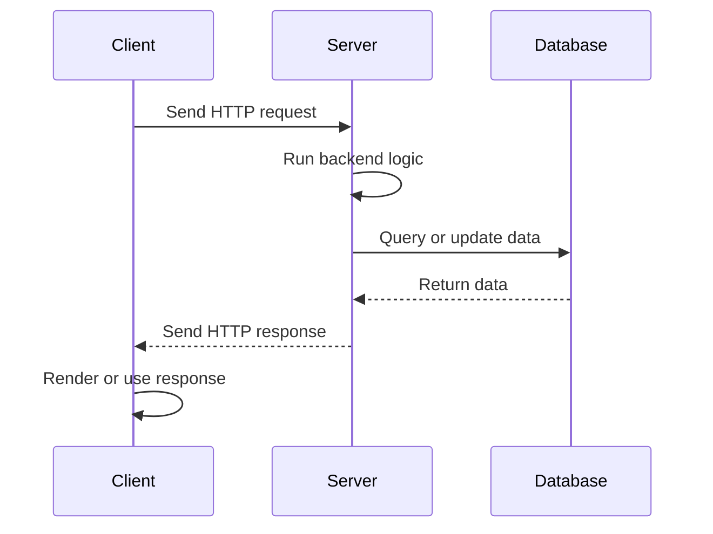
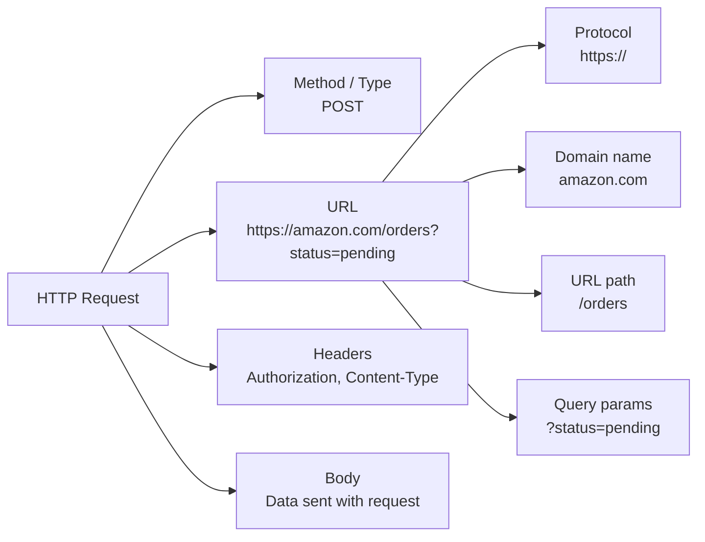

# Terminology

## Request-Response Cycle

Client: Machine/ App/ Program sending a request.
Server: Machine/ App/ Program listening to and responding to requests.

The communication process between a client and a server is called a request response cycle.



Backend Programming Language** enable computers to be turned into servers.  

Popular Languages:

1. Javascscript(Enabled by NodeJS to run outside of a browser)
2. Python
3. Java

Package/Library: A code distribution written by someone else that can be installed and used in your project. Carry out tasks like doing calculations,talking to a database and setting up user authentication and login.

Package Manager: Program for installing packages from the internet. They could be System level and Language Level.

Backend Framework: A software framework built on top of a backend programming language that provides structure, conventions, and prebuilt functionality for developing server-side applications, reducing the amount of boilerplate code developers need to write.

// Example of language, packages, package manager and frameworks

We use our programming language and backend framework to define what *types* of requests are allowed and *how* we should handle these requests

Types of requests can vary by combination of HTTP Method + URL Path
Example:
GET /users
POST /users
GET /users/123

API(Application Programming Interface): The collection of requests that a backend exposes for clients to use, along with the rules for how those requests and responses are structured.

API's could be formed in accordance with different conventions. Some common ones are:

1. REST(Representational State Transfer): The most common way for apps to talk to each other over HTTP. It exposes resources through URL paths like `/users` or `/orders`, and uses HTTP methods like `POST`, `GET`, `PUT`, and `DELETE` (CRUD) to perform actions on those resources.

2. GraphQL: Lets the client ask for exactly the data it needs, usually through one endpoint. Instead of exposing many resource-based URL paths like REST, GraphQL exposes a schema that describes the available data and relationships.

3. gRPC(Google Remote Procedure Call): A framework for calling functions on another service as if they were local functions. It uses strongly defined service contracts and is often used for fast communication between backend services or microservices.

### HTTP Request Elements

Example request:

```http
POST https://amazon.com/orders?status=pending
Authorization: Bearer token
Content-Type: application/json

{
  "productId": 123,
  "quantity": 2
}
```



## Cloud Computing

Infrastructure is any kind of underlying software, hardware, network or cloud services that help the actual app to run.

### IaaS(Infrastructure as a Service): Nowadays, Instead of buying your own computers, you often rent computers from Cloud Computing Companies like AWS(Amazon Web Services), GCP(Google Cloud Platform) and Microsoft Azure

Some infrastructure-focused services that they provide are:

1. Virtual Machines: Virtual computers in the cloud that run as software on physical servers.

    They can be vertically scaled by allocating more CPU, memory, or storage, and horizontally scaled by creating more VM instances.

    You can install an operating system, backend runtime, database, or other server software on them.

    Example include:
    - AWS EC2(Elastic Compute Cloud) instances
    - Azure Virtual Machines
    - Google Compute Engine VM instance

2. Load Balancers: A special VM that distributes incoming traffic across multiple servers, hosted on multiple VM instances, so no single server has to handle everything by itself. These servers can also be located in different geographic regions to reduce latency for users.

    Examples Include:
    - AWS Elastic Load Balancing
    - Azure Load Balancer
    - Google Cloud Load Balancing
    - Cloudflare Load Balancing

3. Object Storage(Blob Storage): Cloud storage for files like images, videos, backups, logs, and documents.

    Each file is stored as an independent object, making it easy to store large amounts of data and access it over the internet.

    It is commonly used for static assets, user uploads, backups, and application logs.

    Examples Include:
    - AWS S3(Simple Storage Service)
    - Google Cloud Storage
    - Azure Blob Storage

4. DNS Services: After you have rented a domain name(like `example.com`) from a domain registrar, a DNS service hosts the DNS records for that domain.

    DNS records map hostnames to targets like server IP addresses, load balancers, CDNs, mail servers, or other cloud services.

    The key detail is that each hostname(under the same domain name) can point to a different target. For example:

    ```text
    example.com        -> CDN
    www.example.com    -> CDN
    api.example.com    -> load balancer
    admin.example.com  -> VM IP address
    mail.example.com   -> mail server
    ```

    Examples Include:
    - Cloudflare DNS
    - AWS Route 53
    - Google Cloud DNS
    - Azure DNS

5. Networking and Security Components: Control how cloud resources communicate with each other and with the public internet.

    Virtual networks, private subnets, public IPs, and routing rules define how traffic moves between servers, databases, and external users.

    Firewalls and security groups define which traffic is allowed or blocked for specific resources.

    Examples Include:
    - AWS VPC(Virtual Private Cloud)
    - Azure Virtual Network
    - Google Virtual Private Cloud
    - Cloudflare Firewall Rules

6. CDN(Content Delivery Network): Caches frequently requeted static files in an edge server that is geographically close to users around the world so websites and apps load faster.

    Static files can include images, videos, CSS, JavaScript, downloads, and other content that does not change for every user.

    Examples Include:
    - AWS CloudFront
    - Google Cloud CDN
    - Azure Front Door
    - Cloudflare CDN

### PaaS(Platform as a Service)

Cloud platforms that let you deploy and run applications by uploading your backend code, without directly managing the underlying VMs, load balancers, deployment setup, health checks, etc.

Examples Include:

- Heroku(owned by Salesforce)
- AWS Elastic Beanstalk
- Google App Engine
- Azure App Service

### SaaS(Software as a Service)

When a company provides a backend and an API that outside applications can use.

For Example: Twilio could provide the entire backend and API setup for the Email Backend service in the microservices example discussed in the next section.

Pretty much everything in the backend that is complicated is offered to be handled by a SaaS company out there.

## Microservices

A backend architecture where one large backend is split into multiple smaller backends, each responsible for a specific business capability or major feature of the application.

For example, an e-commerce app might have:


Each backend is its own service. It can have its own load balancer, multiple server instances, backend code, and database.

Each service can also use different technologies if needed. For example, the Orders Backend might use JavaScript with MongoDB, the Payments Backend might use Python with MySQL, and so on.

This means each service can be developed, deployed, scaled, and maintained separately. For example, if payment traffic increases, you can scale only the Payments Backend without scaling the Orders or Email services.

The tradeoff is that the system becomes more complex because these services now need to communicate with each other over the network, handle failures between services, and keep data consistent across separate databases.

## Data

An app needs to store and retrieve lots of types of data.

## Primary Database: Helps us store and manage data like user data, order history, product information(Description, Rating and the reviews)

It usually runs on a different computer(or VM) as a database server and talks to our main backend server.

Example: MySQL, PostgresSQL, MongoDB

For storing images and videos we would use a blob storage like AWS S3 and a CDN like AWS Cloudfront.

If we want to allow text search, which is very slow on primary database, we would bring in a Search Database like: Elastic Search

Cache: like Redis to reduce load on the primary database

Datascience: For data science we would use an analytical database like Snowflake.

Queue: For Scheduling this task for the future. Example: Rabbit MQ
