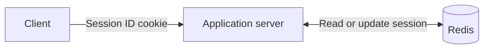

# Cloud Caching

## Redis

Redis is an in-memory data store commonly used to cache frequently accessed database results. It can also support session storage, rate limiting, pub/sub messaging, distributed locks, counters, and task queues.

## Session Management

### Stateful Sessions with Redis

The client stores only an opaque session ID, usually in a cookie, while the corresponding session data(the state) remains in Redis.

#### Mechanism

1. After authentication, the server creates a session in Redis and returns its ID to the client.
2. The client sends the session ID with each subsequent request.
3. The server looks up the session in Redis to identify the user and retrieve session data.
4. Logout or forced revocation deletes the session from Redis.

#### Tradeoffs

1. Sessions can be revoked immediately and updated centrally.
2. Only a small, meaningless identifier is exposed to the client.
3. Every authenticated request normally requires a Redis lookup.
4. Redis becomes infrastructure that must be secured, scaled, and kept available.
5. Storage usage increases with the number and size of active sessions.

### Stateless Sessions with JWT

The client stores a signed JWT containing user claims. The server verifies the token locally instead of retrieving a session from a central store.

#### Mechanism

1. After authentication, the server issues a signed JWT containing claims such as the user ID, roles, and expiration time.
2. The client sends the JWT with each authenticated request.
3. The server validates its signature, expiration, issuer, and other required claims.
4. If the token is valid, the server trusts its claims without loading a session.

#### Tradeoffs

1. Authentication scales easily across application servers because no shared session lookup is required.
2. Local verification avoids a Redis request, but the larger token is transmitted on every request.
3. Immediate revocation is difficult; a stolen token can remain valid until it expires.
4. Role or permission changes may not take effect until a new token is issued.
5. Refresh tokens, rotation, or revocation lists can improve security but reintroduce server-side state.
6. JWT payloads are encoded rather than encrypted, so they must not contain secrets.
