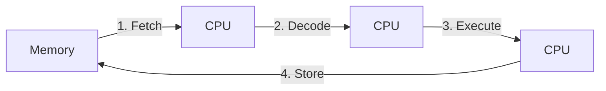

# Computer Architecture

## Terminology

### Hardware

The physical components of a computer system.

Examples:

- CPU
- RAM
- SSD
- GPU
- Keyboard
- Network card

Hardware performs computation and other physical operations under the control of software.

### Software

The broad term for instructions and data that tell computer hardware what to do. Software is non-physical; it is stored as data and instructions on hardware.

Examples of software include:

- Operating systems
- Applications
- Firmware
- Device drivers
- Utilities

### Firmware

A specialized type of software that provides low-level control and is closely tied to a particular piece of hardware.

Firmware is typically stored in non-volatile memory associated with the device.

Examples:

- BIOS/UEFI firmware on a motherboard
- Firmware inside an SSD
- Firmware inside a router
- Firmware controlling a keyboard or mouse

### Application

Software designed to provide useful functionality to a user or another system.

Examples:

- Google Chrome
- VS Code
- Spotify
- Microsoft Word

For example when launching an application like Chrome The first Chrome process is created when the OS launches Chrome. Then Chrome's running code requests additional child processes from the OS. A typical flow looks like:

```text
User clicks application
        ↓
Operating system is asked to run the program
        ↓
OS loads the program's executable into memory
        ↓
OS creates the application's initial process
        ↓
Application code starts executing
        ↓
That process may ask the OS to create additional processes
```

An application may contain multiple programs/components and may run using one or many processes.

For example:

```text
Google Chrome Application
├── Browser Process
├── Renderer Process
├── Renderer Process
├── GPU Process
└── Utility Processes
```

### Program

A **File** is just bytes of data stored on disk. `.txt`, `.png`, `.jpg`, `.cpp` are all files that just differ in how those bytes are arranged. It is always up to the application consuming the file to determine how to interpret it.

A **program** is an executable file on disk. Example: `.exe` on windows, main on linux or a compiled binary file. A **Binary File** contains instructions/data in a form the computer's processor can directly execute or use, rather than human-readable source code.

Sometimes people also call a source code file like `.cpp` a program but the actual program is the compiled binary that will be formed from it.

### Process

Prcocess is an independent Program in execution. Loaded by the OS kernel when you run a program.

- They are more secure and isolated.
- Communication between processes is slower
- Example: Opening VS Code, Google Chrome, etc.

When a process is running, it has its own memory allocation like the heap, stack, code, data segments and its own process ID to keep track of its status by the OS. At any given instance, The CPU only contains the immediate execution state, mainly:

```
CPU
├── Instruction register / pipeline → current instructions being executed
├── Program counter                 → address of next instruction
├── General-purpose registers       → current values/operands
└── Stack pointer, flags, etc.      → current execution state
```

### Thread

- One Continuous flow of execution of instructions in a process
- Shares memory/ resources with other threads in the same processes.
- Example:

```text
Chrome Process
├── UI Thread
├── Rendering Thread
├── Network Thread
└── JavaScript Thread
```

## CPU

CPU(Central Processing Unit) is one of the core pieces of hardware and is responsible for executing instructions.

### CPU Cores

- A physical unit inside the CPU that executes instructions.
- The OS Scheduler maps threads to cores.
- Normally only one thread executes on a CPU core at any instant of time.
- But **Simultaneous multithreading (SMT)** allows one physical CPU core to process two threads at the same time by presenting itself to the OS as two logical cores. Both threads share the physical core's execution resources, so two logical cores do not provide the same performance as two separate physical cores. Intel's calls its implementation of SMT as Hyperthreading.

#### Single Core CPU

- The OS uses a mechanism called *Context Switching* which allows it to repeatedly switch between different threads by saving the state of one thread and loading another thread onto the core.
- Because the OS does this very quickly, multiple threads appear to make progress during the same period of time which gives us *concurrency*

#### Multi Core CPU

- Since there are multiple cores available, multiple threads truly execute simultaneously and make progress at same instant on different cores which is known as *parallelism*.
- But since multiple threads are also making progress during the same period of time this is also concurrency so its parallelism along with concurrency.

### Machine Cycle

Sequence of 4 steps a CPU performs to execute a single machine language instruction.

Example instructions:

- ADD R1, R2 (Add the contents of register R2 to register R1)
- MOV AL, 97 (Put the value 97 into register AL.)



> Not to be confused with a Clock Cycle

**Clock Cycle** is one tick of the CPU's clock. One machine cycle can take several clock cycles and clock cycles differ for different CPUs depending on their frequency (Old Intel: 5MHz, Modern Intel: 3-5GHz).

### Race Conditions

A **race condition** is a software or system flaw where two or more threads, from the same or different processes, try to access and change the same shared data, and the final result depends on the unpredictable order in which they run.

The threads do not need to execute in parallel at the exact same instant. Even on a single CPU core, their steps can interleave during concurrency.

Example:

```python
tickets_left = 1

def reserve_ticket(user):
    global tickets_left

    if tickets_left > 0:         # 1. check shared data
        tickets_left -= 1        # 2. update shared data
        print(f"{user} got a ticket")

# Thread A calls reserve_ticket("A")
# Thread B calls reserve_ticket("B")
```

Possible interleaving:

```text
Initial tickets_left = 1

Thread A checks tickets_left > 0 and passes
Thread B checks tickets_left > 0 and passes
Thread A subtracts 1 and prints "A got a ticket"
Thread B subtracts 1 and prints "B got a ticket"

Two users were told they got a ticket, even though only one ticket existed.
```

The bug is not that the ticket count is wrong by itself. The bug is that `check availability -> reserve ticket -> confirm reservation` was not protected as one indivisible operation.

A **critical section** is the part of code that accesses shared data and must be protected so another concurrent thread cannot interrupt it halfway through.

In the ticket example, the critical section is:

```python
if tickets_left > 0:
    tickets_left -= 1
    print(f"{user} got a ticket")
```

Meaning If one thread is already inside this block, then another thread should not be allowed to enter that same critical section until the first thread finishes it.

#### Locks

A **lock** is a synchronization tool that allows only one thread at a time to enter a protected critical section.

```python
from threading import Lock

tickets_left = 1
tickets_lock = Lock()

def reserve_ticket(user):
    global tickets_left

    with tickets_lock:
        if tickets_left > 0:          # Check shared data
            tickets_left -= 1         # Update shared data
            print(f"{user} got a ticket")  # Confirm the reservation
```

The lock does not make the code faster. It makes the shared-state update correct by forcing the check and write to happen without another thread entering the same protected block.

#### Deadlocks

A **deadlock** happens when concurrent tasks wait on each other forever.

Example:

```text
Thread A holds Lock 1 and waits for Lock 2.
Thread B holds Lock 2 and waits for Lock 1.

Neither thread can continue.
```

Common ways to reduce deadlocks:

- Acquire locks in a consistent order.
- Keep locked sections small.
- Avoid holding a lock while doing slow I/O.
- Use higher-level tools like queues when ownership transfer is clearer than shared mutation.

## Memory

### Process Memory Layout

When a process is started from its executable file on disk, the OS assigns it a virtual address space.

Typical layout for a virtual address space looks like:

```text
High Addresses
+---------------------------+
|           Stack           |
|             ↓             |
+---------------------------+
|                           |
|        Free Space         |
|                           |
+---------------------------+
|             ↑             |
|            Heap           |
+---------------------------+
|   BSS (based on metadata  |
|    from .bss section)     |
+---------------------------+
|  Data (from .data section)|
+---------------------------+
|  Code (from .text section)|
+---------------------------+
Low Addresses
```

#### Code

- Stored in the executable file and loaded into memory when the process starts.
- Contains machine instructions for running the program.
- Raed-only and fixed in size, so nothing can change the code instructions at run time.

Example:

```cpp
#include <iostream>

int main() {
    std::cout << "Hello, World!\n";
    return 0;
}
```

#### Data

- Contains Initialized global and static variables.
- Values are stored directly in the executable file and loaded into memory when the process starts.
- Read/Write accessible
- Fixed in size

Example:

```cpp
int counter = 10;          // Global variable
static int value = 42;     // Static variable
```

#### BSS

- Contains Uninitialized global and static variables.
- The executable stores metadata describing the required size rather than storing large blocks of zero bytes. The OS creates this region and initializes it to zero when the process starts.
- Read/write accessible.
- Fixed in size

Why a BSS section separate from Data?

```cpp
char logBuffer[100000000]; // 100 MB
```

If this variable were stored in the Data section, the executable would need to contain 100 MB of zero bytes, making the executable unnecessarily large.

Instead .bss contains metadata like:

```text
Reserve 100 MB of zero-initialized memory
```

#### Heap

- Stores dynamically allocated memory at runtime.
- Can grow and shrink during program execution.
- Used when the size or lifetime of data cannot be determined at compile time, or when ownership must extend beyond a particular scope.
- Read/Write accessible.
- Typically grows **upward** toward higher addresses.
- Usually shared by all threads in a process.
- Objects can be manually created and removed using `malloc`/`free` in C, `new`/`delete` in C++, or automatically managed through C++ abstractions such as smart pointers and RAII. High level languages such as python have automatic garbage collectors that free up unused objects.

**Memory Leak:** Occurs when heap memory is allocated but never released, even though the program no longer has any way to use it.

Example:

```cpp
int* value = new int(42);
// Forgot: delete value;
```

The pointer may disappear, but the heap memory remains allocated.

#### Stack

- Stores **function call frames** (also called activation records).
  - A function call frame contains information needed for a function invocation, including:
    - Local variables
    - Function parameters
    - Return address (where execution should continue after the function returns)
    - Other bookkeeping information used by the compiler and CPU
  - Each function call creates a new frame on the stack.
  - When a function returns, its frame is automatically removed.
- Memory is allocated and released automatically as functions are entered and exited.
- Each thread has its own stack. In Multi threaded processes the modern Stack section is further divided into separate Stacks.
- Read/Write accessible.
- Typically grows **downward** toward lower addresses

```cpp
int main() {
    int* value = new int(42);

    delete value;
}
```

Visualization:

```text
Stack                    Heap
+------------+          +------+
| value -----+--------->|  42  |
+------------+          +------+
```

**Stack Overflow:** Occurs when a program uses more stack memory than is available, usually because of excessive or infinite recursion. Each function call adds a new frame to the stack, and if too many frames are added without returning, the stack runs out of space.

**Segmentation Fault:** A kind of error that happens when a program tries to access memory it's not allowed to use or isn't valid anymore. The word stems from segmentation in memory and a program accessing a wrong segment

```cpp
int* ptr = nullptr;
*ptr = 42;  // Segmentation fault
```

The program attempts to write through an invalid memory address, causing the OS to terminate it.

### Virtual Memory

Every process sees the memory layout above as if it owns one huge, contiguous block of memory starting near address `0`. This is an illusion maintained jointly by the OS and a piece of CPU hardware called the **MMU** (Memory Management Unit).

In reality:

- Physical RAM is limited and shared by **all** processes at once.
- The free frames available in RAM are scattered, not contiguous.
- The total memory demanded by all processes can exceed the physical RAM installed.

**Virtual memory** is the abstraction layer that hides all of this. It gives each process its own private **virtual address space** and translates the virtual addresses the program uses into real **physical addresses** in RAM at runtime.

Why this is useful:

- **Isolation / security:** A process can only name addresses inside its own space. It has no way to even express an address that points into another process's memory.
- **Simplicity:** Every program can be compiled as if it starts at the same fixed address. The compiler and linker never need to know where in RAM the program will actually be placed.
- **Overcommit:** Because virtual addresses are mapped lazily, processes can reserve far more memory than physically exists, as long as they don't use all of it at once.

#### Pages and Frames

- The virtual address space is divided into fixed-size blocks called **pages** (commonly 4 KB).
- Physical RAM is divided into equally sized blocks called **frames**.
- Any virtual page can be placed in any physical frame. The seemingly contiguous pages of one process do **not** need to land in contiguous frames.

#### Page Table

- Each process has its own data structure called Page Table, maintained by the OS that maps a **virtual page number → physical frame number**.
- Because the table is per-process, the *same* virtual address in two different processes maps to *different* frames. This is what makes isolation work.

**Swapping**

When RAM fills up, the OS moves **cold** (rarely used) pages out to a reserved **swap** area on disk to free frames for active pages. Those pages are paged back in on demand if touched again later.

#### Relation to Processes and Threads

This closes the loop with the earlier sections:

- **Each process** has its own virtual address space backed by its own page table → processes are isolated.
- A **context switch** between processes also switches the active page table (and the TLB is flushed or tagged so stale translations aren't reused).
- **Threads within the same process** share one page table, which is exactly why they share heap and global memory while still getting their own private stacks.

## Operating System(OS)

An operating system is the software layer that manages hardware resources such as CPU, memory, storage, and devices, while also giving applications common services like filesystems, networking, and process management.

An OS is not just one program. It is a collection of components that work together to let applications use hardware safely and consistently.

```text
User space
├── Applications
│   └── ask for OS services through system calls or system libraries
└── System programs and user interfaces
    ├── shell
    ├── terminal
    ├── desktop environment
    └── background services

Kernel space / operating system core
└── Kernel
    ├── process and thread management
    ├── memory management
    ├── filesystems
    ├── networking
    ├── device drivers
    └── permissions and isolation
```

Typical interaction:

```text
Application or shell
  ↓ system call
Kernel
  ↓ controls
Hardware
  ↓ returns result
Kernel
  ↓ returns result
Application or shell
```

### Kernel

The kernel is the core component of an OS. Applications usually do not access hardware directly. Instead, they ask the kernel to perform privileged operations through **system calls**.

The kernel is responsible for managing the most important system resources:

- CPU scheduling
- processes and threads
- memory management
- virtual memory
- filesystems
- device drivers
- networking
- permissions and isolation

#### System Calls

A **system call** is the controlled entry point from a user-space program into the kernel.

Examples:

- creating a process
- reading or writing a file
- allocating memory
- sending data over a network
- asking for information about the system

#### Device Drivers

A **device driver** is software that lets the kernel communicate with a specific hardware device, such as a keyboard, display, network card, or storage drive.

Applications usually do not talk to devices directly. They ask the kernel, and the kernel uses the appropriate driver.

#### Filesystems

A **filesystem** organizes data on storage devices into files and directories.

Applications use file operations like open, read, write, and delete. The kernel and filesystem code translate those requests into lower-level storage operations.

#### User Mode and Kernel Mode

Modern operating systems separate normal application code from privileged kernel code.

- **User mode**: where regular applications run
- **Kernel mode**: where the OS kernel runs

This separation prevents normal programs from directly modifying hardware, other programs' memory, or protected system resources.

#### Kernel in Other Contexts

The word **kernel** can also mean the central execution component of a system.

For example, in a Jupyter Notebook, the Python kernel is the process that executes Python code and maintains runtime state, including variables, functions, classes, and imported modules/packages in memory.

### System Programs and User Interfaces

System programs are normal user-space programs that come with or are closely associated with the OS. They help users and other programs interact with the system.

Examples:

- command-line shells
- terminals
- file managers
- desktop environments
- background services
