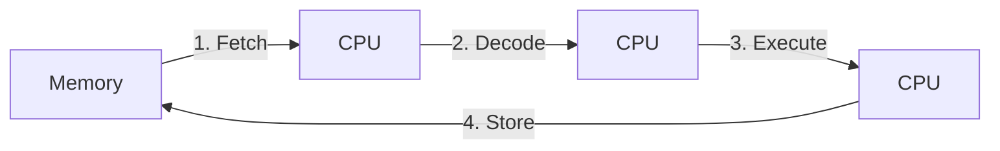

# Computer Architecture

## CPU

### Program

An executable file on disk. Example: .exe on windows, main on linux or a compiled binary.

### Process

- Independent Program in execution. Loaded by the OS kernel when you run a program.
- They are more secure and isolated.
- Communication between processes is slower
- Example: Opening VS Code, Google Chrome, etc.
-

### Thread

- One Continuous flow of execution of instructions in a process
- Shares memory/ resources with other threads in the same processes.
- Example:

```text
Chrome Process
├── UI Thread
├── Rendering Thread
├── Network Thread
└── JavaScript Thread
```

### CPU Cores

- A physical unit inside the CPU that executes instructions.
- The OS Scheduler maps threads to cores.
- Only one thread executes on a CPU core at any intant of time.

#### Single Core CPU

- The OS uses a mechanism called *Context Switching* which allows it to repeatedly switch between different threads by saving the state of one thread and loading another thread onto the core.
- Because the OS does this very quickly, multiple threads appear to make progress during the same time which gives us *concurrency*

#### Multi Core CPU

- Since there are multiple cores available, multiple threads truly execute simultaneously which is known as *parallelism*.
- They have concurrency along with parallelism.

### Machine Cycle

Sequence of 4 steps a CPU performs to execute a single machine language instruction.

Example instructions:

- ADD R1, R2 (Add the contents of register R2 to register R1)
- MOV AL, 97 (Put the value 97 into register AL.)



> Not to be confused with a Clock Cycle

**Clock Cycle** is one tick of the CPU's clock. One machine cycle can take several clock cycles and clock cycles differ for different CPUs depending on their frequency (Old Intel: 5MHz, Modern Intel: 3-5GHz).

## Memory

### Process Memory Layout

When a process is started from its executable file on disk, the OS assigns it a virtual address space.

Typical layout for a virtual address space looks like:

```text
High Addresses
+---------------------------+
|           Stack           |
|             ↓             |
+---------------------------+
|                           |
|        Free Space         |
|                           |
+---------------------------+
|             ↑             |
|            Heap           |
+---------------------------+
|   BSS (based on metadata  |
|    from .bss section)     |
+---------------------------+
|  Data (from .data section)|
+---------------------------+
|  Code (from .text section)|
+---------------------------+
Low Addresses
```

#### Code

- Stored in the executable file and loaded into memory when the process starts.
- Contains machine instructions for running the program.
- Raed-only and fixed in size, so nothing can change the code instructions at run time.

Example:

```cpp
#include <iostream>

int main() {
    std::cout << "Hello, World!\n";
    return 0;
}
```

#### Data

- Contains Initialized global and static variables.
- Values are stored directly in the executable file and loaded into memory when the process starts.
- Read/Write accessible
- Fixed in size

Example:

```cpp
int counter = 10;          // Global variable
static int value = 42;     // Static variable
```

#### BSS

- Contains Uninitialized global and static variables.
- The executable stores metadata describing the required size rather than storing large blocks of zero bytes. The OS creates this region and initializes it to zero when the process starts.
- Read/write accessible.
- Fixed in size

Why a BSS section separate from Data?

```cpp
char logBuffer[100000000]; // 100 MB
```

If this variable were stored in the Data section, the executable would need to contain 100 MB of zero bytes, making the executable unnecessarily large.

Instead .bss contains metadata like:

```text
Reserve 100 MB of zero-initialized memory
```

#### Heap

- Stores dynamically allocated memory at runtime.
- Can grow and shrink during program execution.
- Used when the size or lifetime of data cannot be determined at compile time, or when ownership must extend beyond a particular scope.
- Read/Write accessible.
- Typically grows **upward** toward higher addresses.
- Usually shared by all threads in a process.
- Objects can be manually created and removed using `malloc`/`free` in C, `new`/`delete` in C++, or automatically managed through C++ abstractions such as smart pointers and RAII.

#### Stack

- Stores **function call frames** (also called activation records).
  - A function call frame contains information needed for a function invocation, including:
    - Local variables
    - Function parameters
    - Return address (where execution should continue after the function returns)
    - Other bookkeeping information used by the compiler and CPU
  - Each function call creates a new frame on the stack.
  - When a function returns, its frame is automatically removed.
- Memory is allocated and released automatically as functions are entered and exited.
- Each thread has its own stack. In Multi threaded processes the modern Stack section is further divided into separate Stacks.
- Read/Write accessible.
- Typically grows **downward** toward lower addresses

```cpp
int main() {
    int* value = new int(42);

    delete value;
}
```

Visualization:

```text
Stack                    Heap
+------------+          +------+
| value -----+--------->|  42  |
+------------+          +------+
```

**Memory Leak:** Occurs when heap memory is allocated but never released, even though the program no longer has any way to use it

Example:

```cpp
int* value = new int(42);
// Forgot: delete value;
```

The pointer may disappear, but the heap memory remains allocated.

**Segmentation Fault:** A kind of error that happens when a program tries to access memory it's not allowed to use or isn't valid anymore. The word stems from segmentation in memory and a program accessing a wrong segment

```cpp
int* ptr = nullptr;
*ptr = 42;  // Segmentation fault
```

The program attempts to write through an invalid memory address, causing the OS to terminate it.

### Virtual Memory

Every process sees the memory layout above as if it owns one huge, contiguous block of memory starting near address `0`. This is an illusion maintained jointly by the OS and a piece of CPU hardware called the **MMU** (Memory Management Unit).

In reality:

- Physical RAM is limited and shared by **all** processes at once.
- The free frames available in RAM are scattered, not contiguous.
- The total memory demanded by all processes can exceed the physical RAM installed.

**Virtual memory** is the abstraction layer that hides all of this. It gives each process its own private **virtual address space** and translates the virtual addresses the program uses into real **physical addresses** in RAM at runtime.

Why this is useful:

- **Isolation / security:** A process can only name addresses inside its own space. It has no way to even express an address that points into another process's memory.
- **Simplicity:** Every program can be compiled as if it starts at the same fixed address. The compiler and linker never need to know where in RAM the program will actually be placed.
- **Overcommit:** Because virtual addresses are mapped lazily, processes can reserve far more memory than physically exists, as long as they don't use all of it at once.

#### Pages and Frames

- The virtual address space is divided into fixed-size blocks called **pages** (commonly 4 KB).
- Physical RAM is divided into equally sized blocks called **frames**.
- Any virtual page can be placed in any physical frame. The seemingly contiguous pages of one process do **not** need to land in contiguous frames.

#### Page Table

- Each process has its own data structure called Page Table, maintained by the OS that maps a **virtual page number → physical frame number**.
- Because the table is per-process, the *same* virtual address in two different processes maps to *different* frames. This is what makes isolation work.

**Swapping**

When RAM fills up, the OS moves **cold** (rarely used) pages out to a reserved **swap** area on disk to free frames for active pages. Those pages are paged back in on demand if touched again later.

#### Relation to Processes and Threads

This closes the loop with the earlier sections:

- **Each process** has its own virtual address space backed by its own page table → processes are isolated.
- A **context switch** between processes also switches the active page table (and the TLB is flushed or tagged so stale translations aren't reused).
- **Threads within the same process** share one page table, which is exactly why they share heap and global memory while still getting their own private stacks.
