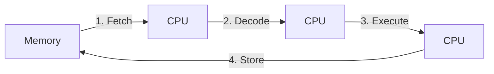

# Hardware Notes

## CPU

### Machine Cycle

Sequence of 4 steps a CPU performs to execute a single machine language instruction.

Example instructions:

- ADD R1, R2 (Add the contents of register R2 to register R1)
- MOV AL, 97 (Put the value 97 into register AL.)

> Not to be confused with a Clock Cycle

**Clock Cycle** is one tick of the CPU's clock. One machine cycle can take several clock cycles and clock cycles differ for different CPUs depending on their frequency (Old Intel: 5MHz, Modern Intel: 3-5GHz).

### CPU cores
