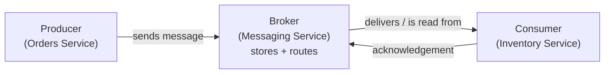

# Messaging Services

A **messaging service** sits between two services that need to talk to each other, so that neither has to be available at the same moment as the other.

In **microservices** architecture it is simpler to understand how the messaging service will be placed between two separate services that need to talk to each other. But it is also used in **monolith** architecture for asynchronous background work or decoupling slow/retryable tasks from the main request path.

**Example Scenario**

The order service makes an HTTP request to the inventory service, waits for a response, and moves on. This works great until the inventory service is slow, down, or getting hammered with traffic. Suddenly the order service is stuck waiting, timing out, or dropping requests on the floor — because it has nowhere to put them.

A messaging service solves this by adding a **buffer** between the services:

- Instead of calling the inventory service directly, the order service drops a message into a queue and returns immediately.
- The inventory service picks that message up whenever it is ready.
- If the inventory service is slow, messages simply accumulate.
- If a flash sale causes a massive spike in orders, the queue **absorbs** the traffic and lets downstream services process it at whatever pace they can handle.

This is called **decoupling**: the producer's availability and speed are no longer tied to the consumer's.

`RabbitMQ`, `SQS` and `Kafka` are the three common implementations, and they hold messages in fundamentally different ways. They are **not** interchangeable — picking the wrong one means significant rework later.

## RabbitMQ

A traditional message broker: a server you run that routes each message into a queue, from which it is delivered to exactly one consumer.

A queue can have many consumers attached — that is how you scale throughput, and it is called the **competing consumers** pattern. The broker deals each message to one of them, so adding workers divides the work rather than duplicating it. Contrast Kafka, where every consumer group receives *every* message.

- **Flow:** producer sends to the broker → broker applies routing rules to pick a queue → consumer pulls and processes → consumer sends an **ack** → **broker deletes the message**. Once consumed, it is gone.
- **Smart broker, simple consumer.** The broker routes, tracks what was delivered, and retries failures. The consumer just connects, processes, and acks.
- **Dead letter queue (DLQ)** — a separate queue for messages that repeatedly fail, so they stop blocking the main queue and can be debugged later. RabbitMQ moves them there automatically.
- **Routing is its differentiator.** You configure rules and the broker decides which queue (and so which worker) a message belongs to, based on its content.
- **Ordering:** strict per queue. One consumer gives perfect order; multiple consumers process in parallel and give that up.
- **You run it:** single binary, straightforward clustering, built-in management UI.

## SQS

The same delete-on-ack queue model, but fully managed by AWS. There is no broker to install, size, or patch, and it scales on its own. You just create a queue on AWS and it gives you a endpoint.

- **Flow:** producer sends to a queue → consumer **long-polls** for messages → processes → explicitly deletes the message. Deleting is the ack.
- **Visibility timeout** replaces broker-push retries: a received message becomes invisible to other consumers for a set window. Delete it in time and it is gone; fail or crash, and it reappears for someone else automatically.
- **Two queue types:**
  - **Standard** — near-unlimited throughput, at-least-once, best-effort ordering.
  - **FIFO** — strict ordering and deduplication within a *message group*, capped far lower (a few thousand msg/sec with batching).
- **No routing.** A queue is just a queue. Fan-out and content-based routing are done by putting **SNS** or **EventBridge** in front of several queues.
- **DLQ built in** via a redrive policy — after N failed receives, the message moves to a DLQ you designate.
- **Retention is capped at 14 days**, and consumed messages are deleted, so there is no replay.
- **Zero operations**, priced per request — but it is AWS-only, which is a lock-in decision.

## Kafka

A **distributed append-only log** — a structure you can only add to the end of, so it is an ordered historical record. Messages are appended and read in order much like a queue; the difference is that reading does not remove them.

- **Flow:** producer **appends** to a topic → the message stays in the log → any number of consumers read it. Reading does not remove anything.
- **Retention**, not consumption, controls lifetime — messages can live for hours, days, or indefinitely.
- **Offsets:** each consumer tracks its own position in the log. Crash and it resumes where it left off; rewind the offset and it **replays** history.
- **Simple broker, smart consumer** — the exact inverse of RabbitMQ. The broker only appends; the consumer decides what to read and when.
- **Fan-out is free.** Independent **consumer groups** each read the whole stream, so analytics, billing, and notifications all consume the same events without affecting each other. A service built six months from now can read from day one.
- **Partitions:** a topic is split into independent logs. A **partition key** decides which one a message lands in, so ordering is guaranteed *per key* (all of customer 12345's orders stay in sequence) but never globally — that is the price of parallelism.
- **Hardest to run:** partition rebalancing, broker failures, and consumer group coordination. Newer versions use **Raft** instead of Zookeeper, but managed options (Confluent Cloud, Amazon MSK, Azure Event Hubs) are worth it without in-house expertise.

## When to use

Use a messaging service in the following scenarios:

- Async Work: User doesn't need work now. Example: Sending Emails, generating reports
- Bursty Traffic: Absorb spikes without dropping requests.
- Decoupling: Services scale and fail independently.
- Reliability: Can't afford to loose work. Broker holds the messages.

Don't use for synchronous work with strict latency requirements.

## Where Each Shines

> RabbitMQ and SQS are queues — messages flow *through* them and are deleted.
> Kafka is a log — messages live *in* it.

That one difference drives everything below.

| | RabbitMQ | SQS | Kafka |
|---|---|---|---|
| After consumption | Deleted | Deleted | Persists until retention expires |
| Replay | No | No | Rewind to any offset |
| Readers per message | One consumer | One consumer | Any number of consumer groups |
| Routing | Rich, broker-side | None (add SNS/EventBridge) | None (consumers filter) |
| Ordering | Global, single consumer | Best-effort, or strict in FIFO | Per partition key |
| Throughput | ~4k–10k msg/sec | Standard: no published ceiling. FIFO: ~3k msg/sec batched | 1M+ msg/sec |
| Latency | ~1–5 ms | ~10–100 ms | ~5–50 ms (batched pulls) |
| Delivery guarantee | At least once | At least once | At least once |
| Operations | You run it | Fully managed | Heaviest, or pay for managed |

**On delivery guarantees:** all three are effectively **at-least-once** — the broker retries until it gets an ack, so no data is lost but a consumer may see a message twice. Kafka advertises *exactly-once*, but it only holds between Kafka topics in one cluster under transactions; write to a database or call an external API and you are back to at-least-once. Assume duplicates and write **idempotent consumers** — processing the same message twice produces the same result as once.

**RabbitMQ shines** for task queues and background jobs — sending emails, processing payments, resizing images — especially when routing logic decides which worker gets which job, and you want sub-5ms latency at moderate scale. *Instagram* uses it for photo upload processing; *Reddit* for comment threads and karma.

**SQS shines** when you are already on AWS and want a queue without running anything. Same workloads as RabbitMQ, traded against no routing and higher latency. The default choice for decoupling Lambda functions and services in an AWS-native stack.

**Kafka shines** when many systems need the same events, when replay matters for debugging or rebuilding state, and at millions of events per second. *Netflix* processes petabytes daily for recommendations and billing; *Uber* for real-time pricing and fraud detection; *LinkedIn* invented it and runs its feed on it.

**Using both is common:** Kafka as the durable event backbone, RabbitMQ or SQS as the task queue processing the work those events trigger.

## Scaling

A messaging service can split a topic or queue into **partitions**, allowing multiple consumers to process messages in parallel. The producer supplies a **partition key**, which is hashed to select a partition; messages with the same key go to the same partition and retain their order.

**Scenario question:** An order service publishes order events. What should the partition key be?

- Use `customer_id` or `order_id` when events for the same customer or order must be processed in order or batched together.
- Use a high-cardinality, evenly distributed key such as `order_id` when maximizing throughput matters and related-message ordering is unnecessary.

Avoid low-cardinality or heavily skewed keys, such as `country`, because they can create a **hot partition**—one partition that receives much more traffic than the others, becomes a bottleneck, and limits scaling.

## Durability and Fault Tolerance

**Durability** prevents stored messages from being lost when the broker itself fails.

**Fault tolerance** allows processing to continue or recover when a broker or consumer fails.

| Service | Broker or storage failure | Consumer failure |
|---|---|---|
| **RabbitMQ** | Durable queues and persistent messages survive restarts; replicated **quorum queues** survive a broker-node failure. | Unacknowledged messages return to the queue for another consumer; repeated failures can go to a DLQ. |
| **SQS** | AWS automatically stores messages redundantly across multiple Availability Zones and handles infrastructure failover. | An undeleted message reappears after its visibility timeout; repeated failures can go to a DLQ. |
| **Kafka** | Partition replicas are stored on multiple brokers; if the leader fails, an in-sync replica becomes leader. Producer `acks=all` provides stronger durability. | A consumer restarts from its last committed offset, so uncommitted messages are processed again. |
