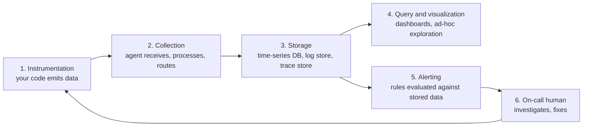
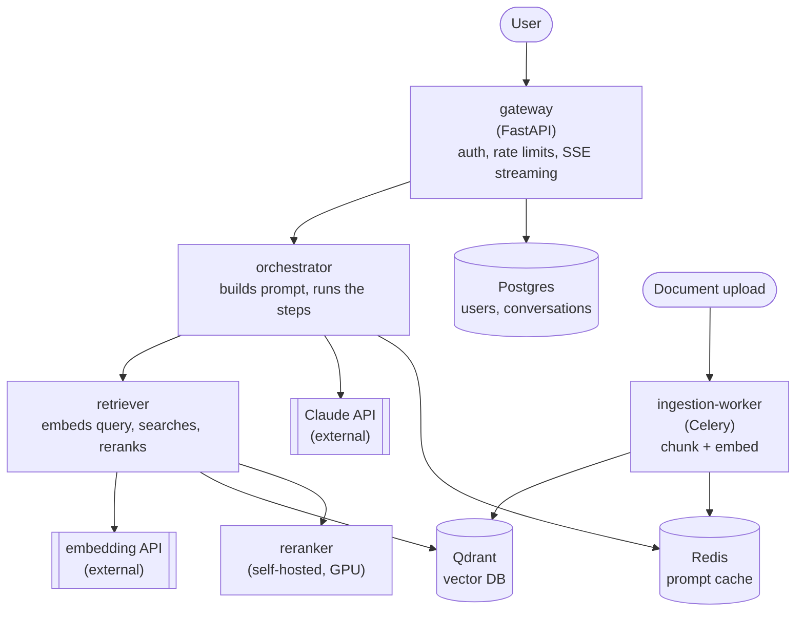
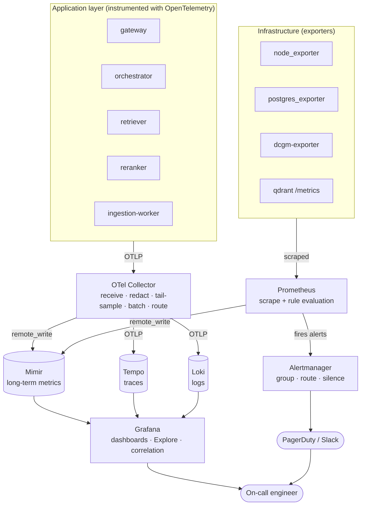
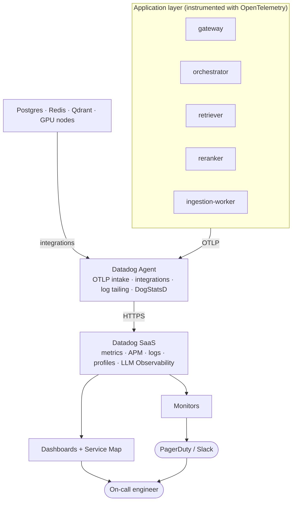

# Observability and Monitoring

Every running system emits signals about itself. Observability is the practice of getting those signals out of the system, into a place where they can be stored and queried, and in front of a human (or an alert) fast enough to matter.

The whole field follows one directional flow, and every tool in this guide sits somewhere on it:



`OpenTelemetry` covers stages 1 and 2.

`Prometheus` covers stage 3 for metrics, and stage 5.

`Grafana` covers stage 4, and stage 5 for the Grafana stack.

`Datadog` covers stages 2 through 5 as one paid product.

## 1. High Level Terminology

### Telemetry

**Telemetry** is data a system emits about its own behaviour, transmitted somewhere else to be examined. The word literally means "remote measurement".

It is the umbrella term. Metrics, logs, and traces are all telemetry. When a tool says it "ingests telemetry", it means it accepts these kinds of data from your running system.

### Instrumentation

**Instrumentation** is the code that produces telemetry — the counter you increment, the log line you write, the timer you start and stop.

Instrumentation comes in two forms:

- **Manual instrumentation:** you write the calls yourself. Needed for anything specific to your domain (how many documents were retrieved, how many tokens a model consumed).
- **Automatic instrumentation:** a library hooks into the frameworks you already use (your web framework, HTTP client, database driver) and emits telemetry without you writing any calls. Gives you broad coverage for free, but only knows about generic concepts like "an HTTP request happened".

Real systems use both: auto-instrumentation for the plumbing, manual for the business logic.

### Monitoring & Observability

**Monitoring** is watching a predefined set of measurements and telling you when one of them crosses a threshold you decided in advance.

You decide beforehand what matters — CPU above 90%, error rate above 1%, queue depth above 10,000 — and the monitoring system checks those conditions continuously. Monitoring answers questions you already knew to ask. It is good at detecting **known failure modes**.

**Observability** is a property of a system: how well you can understand its internal state from the outside, using only the telemetry it emits.

The practical difference from monitoring is the kind of question you can answer:

- Monitoring answers *"is the thing I predicted might break, broken?"*
- Observability answers *"something is broken in a way nobody predicted — what is it?"*

A system is observable if you can ask a **new** question of your existing telemetry, without shipping new code to answer it. If diagnosing an incident always requires adding a log line and redeploying, the system is not observable — you are monitoring it.

Monitoring could be thought of as a subset of observability and the cheap, always-on layer that tells you *something* is wrong. Observability is the expensive, high-detail layer you reach for to find out *what*.

### Signals & Observability backend

A **signal** is a category of telemetry with its own data model. The three core signals are **metrics**, **logs**, and **traces**; **profiles** are an emerging fourth. Each answers a different kind of question, and the tooling for each is different, which is why the rest of this guide is organised around them.

An **observability backend** is the system that receives telemetry, stores it, and lets you query it.

- Prometheus -> metrics backend.
- Loki -> logs backend.
- Tempo -> traces backend.
- Datadog -> backend for all of them at once.

Note: *Grafana* is not a backend — it stores nothing. It is a query and visualization layer that reads from backends. This distinction confuses people constantly.

### Cardinality

**Cardinality** is the number of distinct values a field can take.

`http_method` has low cardinality (about 9 values). `user_id` has high cardinality (millions). `prompt_text` has effectively unbounded cardinality.

Cardinality is the single most important cost driver in observability, and it behaves differently per signal: high-cardinality fields are catastrophic in metrics, cheap in logs, and are the entire point of traces.

## 2. The System We Will Instrument

Everything below is anchored to one example: a **RAG assistant** — a service that answers questions about a company's private documents by retrieving relevant passages and feeding them to a large language model.

> **RAG (Retrieval-Augmented Generation):** instead of relying on what a model memorised during training, you search your own documents for relevant passages at request time and paste them into the prompt. The model generates its answer from that supplied context.



A single question flows: `gateway → orchestrator → retriever → (embed → Qdrant → rerank) → orchestrator → Claude → streamed back to user`.

Things that can go wrong here, which we will use as running examples:

1. Latency creeps up, but only for some users.
2. The token bill triples overnight with no traffic increase.
3. Qdrant returns results, but they are irrelevant, so answers get worse without anything "failing".
4. The GPU reranker silently falls back to CPU after a node restart.
5. The embedding API starts rate-limiting, and ingestion quietly backs up.

Note that #2, #3 and #5 are not errors. Nothing returns a 500. This is the defining problem of AI system observability and it comes back in Section 10.

## 3. The Signals

### Metrics

A **metric** is a numeric measurement aggregated over time, stored as a **time series**.

A time series is identified by a metric name plus a set of key-value **labels** (Prometheus calls them labels, OTel and Datadog call them attributes or tags), and it holds a sequence of `(timestamp, value)` points.

```text
http_requests_total{service="gateway", route="/v1/chat", status="200"}
  1755300000 -> 48213
  1755300015 -> 48291
  1755300030 -> 48355
```

The name plus each unique label combination is a *separate* series. That is the cardinality trap: adding a `user_id` label to a metric with 1M users creates 1M series, each with its own memory, index entry, and disk footprint. Metrics backends fall over from this — it is called a **cardinality explosion**.

**Metric types:**

| Type | Meaning | Can it go down? | Example |
|---|---|---|---|
| **Counter** | Monotonically increasing total | No (only resets to 0 on restart) | `llm_tokens_total`, `http_requests_total` |
| **Gauge** | Value that goes up and down | Yes | `qdrant_index_size_bytes`, `gpu_memory_used_bytes`, `queue_depth` |
| **Histogram** | Distribution, recorded as counts per bucket | N/A | `request_duration_seconds` |
| **Summary** | Distribution, with quantiles computed client-side | N/A | rarely used; quantiles can't be re-aggregated across instances |

You never read a counter's raw value — you read its **rate** of change. `rate(http_requests_total[5m])` gives requests per second, which is what you actually care about, and it survives process restarts.

Histograms deserve attention because they are how you get percentiles. A histogram doesn't store every observation; it stores counts in predefined buckets:

```text
request_duration_seconds_bucket{le="0.1"}   45000   # 45000 requests ≤ 100ms
request_duration_seconds_bucket{le="0.5"}   61000
request_duration_seconds_bucket{le="1.0"}   63000
request_duration_seconds_bucket{le="+Inf"}  63400
request_duration_seconds_sum                18420.5
request_duration_seconds_count              63400
```

From those buckets you can compute an approximate p95 at query time, and — crucially — you can *add buckets across instances* to get a fleet-wide p95. You cannot average p95 values from ten servers to get the real p95; this is a very common mistake.

**What metrics are good at:** cheap, long retention, fast queries over months of data, ideal for dashboards and alerts.
**What they are bad at:** explaining *why*. A metric tells you p95 latency went from 400ms to 3s. It cannot tell you which request or which code path.

### Logs

A **log** is a timestamped record of a discrete event, emitted as text.

**Unstructured logging** is a formatted string:

```text
2026-08-16 14:22:11 ERROR retrieval failed for user 8812 after 3 retries
```

Readable by a human, painful for a machine — extracting "which users failed most" means regex over free text.

**Structured logging** emits key-value data, usually as JSON:

```json
{
  "ts": "2026-08-16T14:22:11.483Z",
  "level": "error",
  "service": "retriever",
  "msg": "retrieval failed",
  "user_id": "8812",
  "collection": "handbook-v3",
  "retries": 3,
  "error_type": "QdrantTimeout",
  "duration_ms": 4021,
  "trace_id": "4bf92f3577b34da6a3ce929d0e0e4736"
}
```

Now every field is queryable, filterable, and aggregatable. **Always use structured logging in a system you intend to observe.**

Unlike metrics, high-cardinality fields in logs are fine — `user_id` is just another field in a document, not a new time series. This is why logs are where you put identifiers.

**Log levels** control volume and urgency:

| Level | Meaning | Use in the assistant |
|---|---|---|
| `DEBUG` | Detailed developer tracing | Chunk boundaries chosen during ingestion |
| `INFO` | Normal, notable events | "answered question", "document ingested" |
| `WARNING` | Something unexpected but handled | Fell back to CPU reranker |
| `ERROR` | Operation failed | Claude API returned 500 after retries |
| `CRITICAL` | Process/system is unusable | Cannot reach Qdrant at startup |

The **`trace_id` field is the most important one in that JSON.** It is what lets you jump from a log line to the full request it belongs to, which is the subject of the next signal.

**What logs are good at:** detail, arbitrary fields, forensic reconstruction.
**What they are bad at:** volume and cost. A busy service producing 10KB/s of logs per instance across 100 instances is 86GB/day. Ingest and index costs are the number one surprise line item in observability bills.

### Traces

A **trace** is the record of one request's complete journey through a distributed system, assembled from **spans**.

A **span** is a single named unit of work with a start time, a duration, a set of attributes, a status, and a parent. One span = one operation ("query Qdrant", "call Claude", "verify JWT"). Spans nest to form a tree; the root span is the whole request.

For our assistant, one question produces this trace:

```text
Trace 4bf92f3577b34da6a3ce929d0e0e4736                      total 3.42s
└─ POST /v1/chat                    gateway        3.42s
   ├─ auth.verify_token             gateway        0.01s
   ├─ db.query conversations        gateway        0.04s
   └─ orchestrator.answer           orchestrator   3.36s
      ├─ cache.get prompt           orchestrator   0.00s   miss
      ├─ rag.retrieve               retriever      2.03s
      │  ├─ rag.embed_query         retriever      0.18s
      │  ├─ qdrant.search           retriever      0.24s   top_k=50
      │  └─ rag.rerank              reranker       1.60s   <-- the problem
      └─ gen_ai.chat claude-opus-5  orchestrator   1.31s   in=8214 out=412
```

You can immediately see where the 3.42 seconds went. No metric could have told you this, and reconstructing it from logs across four services would have taken an hour.

**Trace context propagation** is what makes this work. The `trace_id` is generated at the entry point and passed to every downstream call, conventionally in the W3C `traceparent` HTTP header:

```text
traceparent: 00-4bf92f3577b34da6a3ce929d0e0e4736-00f067aa0ba902b7-01
             ^v ^trace-id                        ^parent-span-id   ^flags
```

Each service reads the incoming header, creates its spans as children of that parent, and passes a new header downstream. If any service drops the header, the trace breaks in two and you lose the connection.

**Span attributes** are the key-value pairs attached to a span (`top_k=50`, `gen_ai.usage.input_tokens=8214`). Traces are the *right* place for high-cardinality data — spans are stored as individual events, not aggregated series, so `user_id` on a span costs nothing structural.

**Sampling** is how you control trace cost, since storing every span of every request is prohibitive at scale:

| Strategy | How it works | Trade-off |
|---|---|---|
| **Head-based** | Decide at the root span, e.g. keep 10% randomly | Cheap, decided instantly, but you throw away rare errors |
| **Tail-based** | Buffer the whole trace, decide after it completes | Can keep 100% of errors and slow traces, but needs memory and all spans of a trace routed to the same collector |

Tail-based sampling with rules like *"keep everything with an error, everything over 2s, and 5% of the rest"* is the usual production answer.

### Profiles

**Continuous profiling** is the emerging fourth signal: periodically sampling stack traces from running processes to see which functions consume CPU time or allocate memory, in production, continuously.

Traces tell you *which span* was slow. Profiles tell you *which line of code inside that span* was slow. Useful for our reranker: a trace says `rag.rerank` took 1.6s; a profile says 1.4s of it was in a tokenizer running on CPU.

Tooling: Grafana Pyroscope, Datadog Continuous Profiler, Polar Signals. OpenTelemetry's profiling signal is still in development.

### Choosing the Right Signal

| Question | Signal |
|---|---|
| Is the system healthy right now? | Metrics |
| How has p95 latency trended over 30 days? | Metrics |
| Why was *this specific request* slow? | Traces |
| Which service in the chain is the bottleneck? | Traces |
| What exactly happened to user 8812 at 14:22? | Logs |
| What was the actual error message and stack? | Logs |
| Which function is burning the CPU? | Profiles |

The practical rule for what to emit:

- If you will **alert or dashboard** on it, make it a **metric** — and keep its labels low-cardinality.
- If you need **per-request detail with identifiers**, put it on a **span**.
- If you need **the full story of one event including free text**, write a **log** — with the `trace_id` in it.

Emit all three from the same code path and correlate them by `trace_id`. That correlation is what turns three separate tools into one system.

## 4. Turning Signals Into Decisions

Collecting telemetry is worthless without a framework for what to look at. These are the standard ones.

### The Four Golden Signals

From Google's SRE practice, the four things to measure for any user-facing service:

1. **Latency** — how long requests take. Measure successful and failed requests separately; a fast 500 will otherwise flatter your numbers.
2. **Traffic** — demand on the system (requests/sec, tokens/sec).
3. **Errors** — rate of failed requests, explicit (500s) or implicit (a 200 containing a garbage answer).
4. **Saturation** — how full the system is (GPU memory, queue depth, connection pool usage). The leading indicator; saturation rises before latency does.

### RED and USE

Two derived methods that tell you *which* things to apply the signals to:

- **RED** — for **services**: **R**ate, **E**rrors, **D**uration. Apply to every service in the assistant: gateway, orchestrator, retriever, reranker.
- **USE** — for **resources**: **U**tilization, **S**aturation, **E**rrors. Apply to every resource: CPU, GPU, memory, disk, Qdrant, the Redis connection pool.

Between them you cover both "is my code working" and "is my infrastructure sufficient".

### SLI, SLO, SLA, and Error Budgets

- **SLI (Service Level Indicator):** a measurement of a user-facing quality. *"Proportion of `/v1/chat` requests that return a first token in under 2 seconds."*
- **SLO (Service Level Objective):** the target for that SLI. *"99% of `/v1/chat` requests return a first token in under 2 seconds, measured over 30 days."*
- **SLA (Service Level Agreement):** a contractual promise to a customer with financial penalties. Always looser than your internal SLO.
- **Error budget:** `100% − SLO`. A 99% SLO over 30 days permits 7.2 hours of failure. That budget is a resource to *spend* — on risky deploys, experiments, migrations. When it is exhausted, you stop shipping features and fix reliability.

This matters for alerting, because it changes what you page on.

### Alerting Philosophy

**Alert on symptoms, not causes.** "p95 latency exceeds SLO" is a symptom — it always means users are affected. "CPU is at 90%" is a cause — it might mean nothing at all. Pages should map to user pain; causes belong on dashboards for diagnosis.

**Burn-rate alerting** is the modern approach: instead of "error rate > 1%", alert when you are consuming the error budget faster than sustainable. A multi-window, multi-burn-rate setup pages loudly for fast burns (budget gone in hours) and files a ticket for slow burns (budget gone in days).

**Alert fatigue** is the real failure mode of monitoring. Every alert that fires without requiring action trains the on-call to ignore alerts. The test for a page: *if this fires at 3am, is there something a human must do right now?* If not, it is a dashboard or a ticket, not a page.

## 5. OpenTelemetry

### The Problem It Solves

Before OpenTelemetry, instrumentation was vendor-specific. Using Datadog meant `ddtrace` calls throughout your codebase. Switching to New Relic meant rewriting all of it. And every library author had to decide which vendors to support — an N×M problem between M languages/frameworks and N vendors.

**OpenTelemetry (OTel)** is a vendor-neutral standard for generating, collecting, and exporting telemetry. It is a CNCF project and is now the second most active project there after Kubernetes.

**The core value proposition: instrument once, send anywhere.** Your code emits OTel. Where that data lands — Prometheus, Grafana, Datadog, or all three — becomes a configuration change, not a code change.

**What OTel is not:** it is not storage, not a database, and not a UI. It ends at the point of export. You always need a backend behind it.

### The Parts

| Component | What it is |
|---|---|
| **Specification** | Language-agnostic definition of the data model and API behaviour |
| **API** | The interfaces your code calls (`tracer.start_span(...)`). Safe for libraries to depend on — a no-op if no SDK is installed |
| **SDK** | The implementation: sampling, batching, and export. Applications install this; libraries do not |
| **Instrumentation libraries** | Ready-made auto-instrumentation for frameworks (FastAPI, requests, psycopg, Celery, Redis) |
| **OTLP** | OpenTelemetry Protocol — the wire format for shipping telemetry (gRPC on port 4317, HTTP on 4318) |
| **Collector** | A standalone binary that receives, processes, and re-exports telemetry |
| **Semantic conventions** | Standard attribute names, so `http.request.method` means the same thing everywhere |

The API/SDK split is the clever bit: a library like `httpx` can emit OTel spans through the API with zero cost when the application hasn't configured an SDK.

### Instrumenting the Assistant

Auto-instrumentation first, since it costs almost nothing:

```bash
pip install opentelemetry-distro opentelemetry-exporter-otlp
opentelemetry-bootstrap -a install     # detects installed libs, installs their instrumentations

OTEL_SERVICE_NAME=orchestrator \
OTEL_EXPORTER_OTLP_ENDPOINT=http://otel-collector:4317 \
OTEL_TRACES_SAMPLER=parentbased_always_on \
opentelemetry-instrument python -m app.main
```

That alone produces spans for every HTTP request served, every outbound HTTP call, every Postgres query, and every Redis operation — with context propagated between services automatically.

Then manual spans for what only you understand — the RAG steps:

```python
from opentelemetry import trace

tracer = trace.get_tracer("assistant.orchestrator")

async def answer(question: str, user_id: str, top_k: int = 50) -> str:
    with tracer.start_as_current_span("rag.retrieve") as span:
        span.set_attribute("rag.top_k", top_k)
        span.set_attribute("rag.collection", "handbook-v3")
        span.set_attribute("enduser.id", user_id)          # high cardinality: fine on a span

        chunks = await retriever.search(question, top_k=top_k)

        span.set_attribute("rag.chunks_returned", len(chunks))
        span.set_attribute("rag.top_score", chunks[0].score if chunks else 0.0)
        if not chunks:
            span.add_event("retrieval.empty", {"question_length": len(question)})
            span.set_status(trace.Status(trace.StatusCode.ERROR, "no chunks retrieved"))

    return await call_model(question, chunks)
```

Note `rag.top_score` — a retrieval-quality number recorded per request. That is how problem #3 from Section 2 (irrelevant results, nothing "failing") becomes visible.

### Semantic Conventions, Including GenAI

**Semantic conventions** are OTel's agreed attribute names. Using them is what makes backends able to build charts for you automatically: Datadog and Grafana both recognise `http.server.request.duration` without being told.

OTel has a dedicated set of **GenAI semantic conventions** for LLM calls:

| Attribute | Example |
|---|---|
| `gen_ai.operation.name` | `chat`, `embeddings` |
| `gen_ai.system` | `anthropic`, `openai` |
| `gen_ai.request.model` | `claude-opus-5` |
| `gen_ai.request.max_tokens` | `4096` |
| `gen_ai.response.model` | `claude-opus-5` |
| `gen_ai.response.finish_reasons` | `["end_turn"]` |
| `gen_ai.usage.input_tokens` | `8214` |
| `gen_ai.usage.output_tokens` | `412` |

Plus two standard metrics: `gen_ai.client.token.usage` and `gen_ai.client.operation.duration`, both histograms.

```python
with tracer.start_as_current_span("chat claude-opus-5") as span:
    span.set_attribute("gen_ai.operation.name", "chat")
    span.set_attribute("gen_ai.system", "anthropic")
    span.set_attribute("gen_ai.request.model", "claude-opus-5")

    response = await client.messages.create(...)

    span.set_attribute("gen_ai.usage.input_tokens", response.usage.input_tokens)
    span.set_attribute("gen_ai.usage.output_tokens", response.usage.output_tokens)
    span.set_attribute("gen_ai.response.finish_reasons", [response.stop_reason])
```

> The GenAI conventions are still marked development/experimental and attribute names have shifted between releases (for example `gen_ai.system` versus the newer `gen_ai.provider.name`). Pin your instrumentation versions and check the spec for the release you are on rather than trusting a name you saw in a blog post.

### The Collector

The **OTel Collector** is a separate process that sits between your applications and your backends. Applications export OTLP to the Collector; the Collector decides what happens next.

Why bother instead of exporting straight to a backend:

- Your app needs one exporter (OTLP), not one per destination.
- Backend credentials and endpoints live in the Collector, not in every service.
- Sampling, filtering, redaction, and batching happen centrally.
- You can switch or add a backend without redeploying a single service.

Its config is a set of **pipelines**, each built from **receivers** (input) → **processors** (transform) → **exporters** (output):

```yaml
receivers:
  otlp:
    protocols:
      grpc: { endpoint: 0.0.0.0:4317 }
      http: { endpoint: 0.0.0.0:4318 }

processors:
  batch:
    timeout: 5s
  memory_limiter:
    check_interval: 1s
    limit_percentage: 80
  # never let a prompt or a user email reach the backend
  attributes/redact:
    actions:
      - key: gen_ai.prompt
        action: delete
      - key: enduser.email
        action: delete
  # keep every error and slow trace, 5% of the rest
  tail_sampling:
    decision_wait: 10s
    policies:
      - name: errors
        type: status_code
        status_code: { status_codes: [ERROR] }
      - name: slow
        type: latency
        latency: { threshold_ms: 2000 }
      - name: baseline
        type: probabilistic
        probabilistic: { sampling_percentage: 5 }

exporters:
  prometheusremotewrite:
    endpoint: http://mimir:9009/api/v1/push
  otlp/tempo:
    endpoint: tempo:4317
    tls: { insecure: true }
  otlphttp/loki:
    endpoint: http://loki:3100/otlp

service:
  pipelines:
    traces:
      receivers: [otlp]
      processors: [memory_limiter, attributes/redact, tail_sampling, batch]
      exporters: [otlp/tempo]
    metrics:
      receivers: [otlp]
      processors: [memory_limiter, batch]
      exporters: [prometheusremotewrite]
    logs:
      receivers: [otlp]
      processors: [memory_limiter, attributes/redact, batch]
      exporters: [otlphttp/loki]
```

That single file is the routing table for your entire observability system. Changing `otlp/tempo` to `datadog` migrates all your tracing to Datadog with no application changes — which is exactly the lock-in escape OTel promises.

**Deployment shapes:**

- **Agent mode** — one Collector per host or Kubernetes node (a DaemonSet), or as a sidecar. Low latency, adds host metadata, absorbs backpressure close to the app.
- **Gateway mode** — a central Collector cluster all agents forward to. Needed for tail-based sampling (all spans of a trace must reach the same instance) and for centralised egress.

Production usually runs both: agents collect, gateway decides.

## 6. Prometheus

### What It Is

**Prometheus** is an open-source time-series database and monitoring system, purpose-built for metrics. It is the de-facto standard for metrics in the cloud-native world and was the second CNCF project to graduate, after Kubernetes.

Prometheus occupies stage 3 (metrics storage) and stage 5 (alert rule evaluation) of the pipeline.

### The Pull Model

Prometheus's defining design choice: **it scrapes**. Rather than services pushing metrics to it, Prometheus periodically fetches an HTTP endpoint on each target — conventionally `/metrics` — and parses the response.

```text
# HELP llm_tokens_total Tokens consumed by model calls
# TYPE llm_tokens_total counter
llm_tokens_total{model="claude-opus-5",direction="input"} 184203941
llm_tokens_total{model="claude-opus-5",direction="output"} 9204183
# HELP rag_retrieval_duration_seconds Time to retrieve chunks
# TYPE rag_retrieval_duration_seconds histogram
rag_retrieval_duration_seconds_bucket{stage="rerank",le="0.5"} 84021
rag_retrieval_duration_seconds_bucket{stage="rerank",le="1.0"} 91002
rag_retrieval_duration_seconds_bucket{stage="rerank",le="+Inf"} 91940
rag_retrieval_duration_seconds_sum{stage="rerank"} 62104.2
rag_retrieval_duration_seconds_count{stage="rerank"} 91940
```

Consequences of pulling:

- **Target health is free.** A failed scrape *is* a signal (`up == 0`), so you detect a dead instance without it having to tell you.
- **No backpressure on your app.** A slow Prometheus cannot slow your service down.
- **You need service discovery.** Prometheus must know what to scrape. It integrates with Kubernetes, Consul, EC2, DNS, and static files.
- **Short-lived jobs are awkward.** A Celery task that lives 3 seconds may never be scraped. The **Pushgateway** exists for this narrow case, and is easy to misuse — the rule is push only from batch jobs, never from long-running services.

Recent Prometheus versions also accept OTLP writes directly, so an OTel Collector can push into it rather than exposing a scrape endpoint. The pull model remains the default and the more common design.

### Instrumenting for Prometheus

```python
from prometheus_client import Counter, Histogram, Gauge, start_http_server

LLM_TOKENS = Counter(
    "llm_tokens_total", "Tokens consumed by model calls",
    ["model", "direction"],                       # low cardinality: ~6 series
)
RETRIEVAL_DURATION = Histogram(
    "rag_retrieval_duration_seconds", "Retrieval stage duration",
    ["stage"], buckets=(0.05, 0.1, 0.25, 0.5, 1.0, 2.5, 5.0),
)
QUEUE_DEPTH = Gauge(
    "ingestion_queue_depth", "Documents waiting to be embedded",
)

start_http_server(9100)     # exposes /metrics

with RETRIEVAL_DURATION.labels(stage="rerank").time():
    chunks = reranker.rerank(candidates)

LLM_TOKENS.labels(model="claude-opus-5", direction="input").inc(response.usage.input_tokens)
```

Note the label choices. `model` and `direction` are bounded. Had we added `user_id` or `conversation_id`, we would have created an unbounded number of series and eventually taken Prometheus down. **Identifiers belong on spans and in logs, never in metric labels.**

### Exporters

An **exporter** is a small process that translates some third-party system's metrics into the Prometheus format. You do not modify Qdrant or Postgres; you run an exporter next to it.

| Exporter | Provides |
|---|---|
| `node_exporter` | Host CPU, memory, disk, network |
| `postgres_exporter` | Connections, locks, replication lag, slow queries |
| `redis_exporter` | Hit rate, evictions, memory |
| `dcgm-exporter` | NVIDIA GPU utilisation, memory, temperature, power |
| `blackbox_exporter` | Probes endpoints from outside (is the API reachable?) |
| cAdvisor / kube-state-metrics | Container and Kubernetes object state |

For our assistant, `dcgm-exporter` on the reranker node is what catches problem #4 from Section 2 — GPU utilisation drops to zero while the service stays "healthy".

### PromQL

**PromQL** is Prometheus's query language. It operates on time series, not rows, so it takes a little adjustment.

```promql
# Requests per second by route, over the last 5 minutes
sum by (route) (rate(http_requests_total{service="gateway"}[5m]))

# Error ratio
sum(rate(http_requests_total{service="gateway",status=~"5.."}[5m]))
  /
sum(rate(http_requests_total{service="gateway"}[5m]))

# p95 retrieval latency per stage, aggregated correctly across all instances
histogram_quantile(
  0.95,
  sum by (le, stage) (rate(rag_retrieval_duration_seconds_bucket[5m]))
)

# Output tokens per second by model — the cost driver
sum by (model) (rate(llm_tokens_total{direction="output"}[5m]))

# Estimated hourly spend (input $3/Mtok, output $15/Mtok — illustrative)
  sum(rate(llm_tokens_total{direction="input"}[5m]))  * 3600 * 3  / 1e6
+ sum(rate(llm_tokens_total{direction="output"}[5m])) * 3600 * 15 / 1e6

# Instances that are down
up{job="retriever"} == 0
```

The `rate(...[5m])` idiom on counters, and `sum by (le, ...)` before `histogram_quantile`, are the two patterns you will use constantly.

### Recording Rules and Alerting Rules

**Recording rules** precompute expensive queries on a schedule and store the result as a new series, so dashboards load fast:

```yaml
groups:
  - name: assistant-recording
    interval: 30s
    rules:
      - record: service:request_latency_p95:5m
        expr: |
          histogram_quantile(0.95,
            sum by (le, service) (rate(http_request_duration_seconds_bucket[5m])))
```

**Alerting rules** are PromQL expressions that, when they return results for longer than `for`, fire an alert:

```yaml
groups:
  - name: assistant-alerts
    rules:
      - alert: ChatLatencySLOBreach
        expr: service:request_latency_p95:5m{service="gateway"} > 2
        for: 10m
        labels: { severity: page }
        annotations:
          summary: "p95 chat latency {{ $value | humanizeDuration }}, SLO is 2s"
          runbook: "https://wiki/runbooks/chat-latency"

      - alert: TokenSpendSpike
        expr: |
          sum(rate(llm_tokens_total{direction="output"}[30m]))
            > 3 * sum(rate(llm_tokens_total{direction="output"}[30m] offset 1d))
        for: 15m
        labels: { severity: page }
        annotations:
          summary: "Output token rate is 3x yesterday at the same hour"

      - alert: IngestionBacklogGrowing
        expr: deriv(ingestion_queue_depth[30m]) > 0 and ingestion_queue_depth > 5000
        for: 20m
        labels: { severity: ticket }
        annotations:
          summary: "Ingestion queue growing and above 5000"

      - alert: RerankerGPUIdle
        expr: avg(DCGM_FI_DEV_GPU_UTIL{job="reranker"}) < 5
        for: 10m
        labels: { severity: page }
        annotations:
          summary: "Reranker GPU idle — likely silent CPU fallback"
```

`TokenSpendSpike` and `RerankerGPUIdle` are the alerts a traditional web-app monitoring setup would never think to write, and they are exactly the ones an AI system needs.

### Alertmanager

Prometheus *evaluates* rules; **Alertmanager** decides what to *do* with the resulting alerts. It handles:

- **Grouping** — 40 instances failing become one notification, not 40.
- **Routing** — `severity: page` to PagerDuty, `severity: ticket` to Jira, everything to a Slack channel.
- **Deduplication** — multiple Prometheus replicas firing the same alert produce one notification.
- **Silencing** — mute alerts during a planned migration.
- **Inhibition** — if the whole cluster is down, suppress the 200 per-service alerts it caused.

Inhibition is the underrated one; it is the difference between one meaningful page and a pager storm.

### Scaling Limits

A single Prometheus is a single node with local disk. Retention is typically weeks, and it has no native clustering or long-term storage. Once you outgrow it, you use `remote_write` to ship samples to a horizontally scalable, Prometheus-compatible backend:

| Option | Notes |
|---|---|
| **Thanos** | Sidecar model, object storage for long-term, global query view |
| **Grafana Mimir** | Grafana Labs' scalable Prometheus backend, object storage |
| **VictoriaMetrics** | Efficient single-binary or clustered alternative |
| **Grafana Cloud / managed** | Hosted, no operations |

All of them keep PromQL, so your queries, dashboards, and alerts survive the migration.

## 7. Grafana and the Grafana Stack

### Grafana Itself

**Grafana** is an open-source visualization and query layer. It stores no telemetry. It connects to **data sources** — Prometheus, Loki, Tempo, Postgres, Datadog, CloudWatch, and dozens more — queries them on your behalf, and renders the results.

This is the point people miss most often: *Prometheus is the database, Grafana is the window*. You can run Prometheus without Grafana (it has a basic built-in UI) and Grafana without Prometheus (pointed at anything else).

Its value is that it puts every backend behind one interface. A single dashboard can show a Prometheus metric panel, a Loki log panel, and a Tempo trace panel side by side, all filtered by the same time range and the same template variable.

**Core concepts:**

| Concept | Meaning |
|---|---|
| **Data source** | A configured connection to a backend |
| **Dashboard** | A saved collection of panels, stored as JSON (keep it in git) |
| **Panel** | One visualization — time series, stat, table, heatmap, histogram |
| **Variable** | A dashboard-level dropdown (`$service`, `$model`) templated into queries |
| **Explore** | Ad-hoc query mode for investigation, no dashboard needed |
| **Annotation** | A vertical marker on a graph — deploys, incidents, config changes |

Annotating deploys is a cheap, high-value habit: half of all "why did this get slow at 14:20" questions are answered by a deploy marker at 14:19.

### The LGTM Stack

Grafana Labs builds a backend for each signal, designed around the same idea: **index only a small set of labels, keep the bulk in cheap object storage.**

| Component | Signal | Query language | Notes |
|---|---|---|---|
| **Loki** | Logs | LogQL | Indexes labels only, not log content. Much cheaper than full-text engines |
| **Grafana Tempo** | Traces | TraceQL | Trace storage in object storage; very cheap per trace |
| **Grafana Mimir** | Metrics | PromQL | Scalable long-term Prometheus storage |
| **Grafana Pyroscope** | Profiles | — | Continuous profiling |

They are often referred to as the **LGTM stack** (Loki, Grafana, Tempo, Mimir).

LogQL deliberately resembles PromQL, which shortens the learning curve and lets you turn logs into metrics:

```logql
# Errors from the retriever mentioning Qdrant
{service="retriever", level="error"} |= "Qdrant"

# Parse JSON logs and filter on a field
{service="retriever"} | json | duration_ms > 3000 | line_format "{{.user_id}} {{.error_type}}"

# Derive a metric from logs: error rate by type
sum by (error_type) (rate({service="retriever", level="error"} | json [5m]))
```

Loki's cost model has a sharp edge that mirrors Prometheus's: **labels must be low-cardinality**. `{service, level, env, namespace}` is right. Putting `user_id` or `trace_id` in a Loki *label* creates a stream explosion — those belong inside the log line, where the `| json` filter can still reach them.

### Correlation: What Makes It One System

Three separate backends only become one system if you can move between them. Grafana provides that:

- **Exemplars** — a histogram bucket can carry a sample `trace_id`. In Grafana, the p95 latency graph shows little diamonds; clicking one opens the exact trace behind that slow request. This is the single best latency-debugging feature in the stack: metric → trace in one click.
- **Trace-to-logs** — configure the Tempo data source with the log labels to match, and every span gets a "Logs for this span" button that runs a Loki query filtered on that `trace_id` and time window.
- **Logs-to-trace** — Loki detects a `trace_id` field in a log line and renders it as a link into Tempo.
- **Trace-to-metrics** — jump from a span to the RED metrics for that service.

This loop — *alert fires → dashboard shows the spike → exemplar jumps to the trace → span links to the logs* — is the entire debugging workflow, and it works only because every signal carries the same `trace_id`.

### Grafana Alerting

Modern Grafana has its own unified alerting engine that evaluates rules across *any* data source, not just Prometheus, and manages notification routing itself (using an embedded Alertmanager).

So you have a choice:

| | Prometheus rules + Alertmanager | Grafana Alerting |
|---|---|---|
| Rule definition | YAML alongside Prometheus config | Grafana UI, or provisioned as YAML |
| Data sources | Prometheus only | Any data source, including Loki logs and SQL |
| Works if Grafana is down | Yes | No |
| Best for | Core infrastructure paging | Cross-source rules, teams working in the UI |

A common split: keep critical infrastructure alerts in Prometheus rules (fewest moving parts, survives a Grafana outage), and use Grafana Alerting for anything needing multiple data sources — like *"error logs spiked AND latency rose"*.

## 8. Datadog

### What It Is

**Datadog** is a commercial SaaS observability platform. Where the previous three sections describe components you assemble, Datadog is the assembled product: collection, storage, querying, dashboards, and alerting for every signal, in one place, operated by someone else.

Its coverage spans the whole pipeline from stage 2 to stage 5.

### How Data Gets In

The **Datadog Agent** runs on each host or as a Kubernetes DaemonSet and handles everything:

- **Metrics** — host metrics, plus 800+ integrations (Postgres, Redis, Qdrant, NVIDIA GPUs, Kubernetes) that it discovers and scrapes automatically, including any Prometheus `/metrics` endpoint.
- **Custom metrics** — via **DogStatsD**, a UDP protocol your app fires metrics at with negligible latency.
- **Traces** — the embedded trace agent receives spans from Datadog tracing libraries (`ddtrace`) or over OTLP.
- **Logs** — tails files or receives them directly, and can process/redact before shipping.

Crucially, **the Agent accepts OTLP on ports 4317/4318**, and there is also a Datadog exporter for the OTel Collector, plus a Datadog-distributed OTel Collector build. So you can instrument entirely with OpenTelemetry and still use Datadog as the backend.

### The Product Surface

| Product | Role |
|---|---|
| **Infrastructure Monitoring** | Hosts, containers, Kubernetes, cloud resources |
| **APM** | Distributed tracing, service map, per-endpoint performance |
| **Log Management** | Ingest, parse, index, and search logs |
| **Continuous Profiler** | Production profiling |
| **RUM (Real User Monitoring)** | Browser/mobile-side performance and errors |
| **Synthetics** | Scripted probes from outside your network |
| **Watchdog** | Automated anomaly detection across your telemetry |
| **LLM Observability** | Purpose-built tracing for LLM/agent applications |
| **Monitors** | Alert definitions across any of the above |

Two of these matter especially for our assistant:

- **Service Map** — Datadog derives your architecture from trace data and draws it, with health per edge. For a system where `gateway → orchestrator → retriever → reranker` was assembled by three different teams, an automatically accurate architecture diagram is worth a lot.
- **LLM Observability** — traces LLM and agent calls specifically, surfacing prompts and responses, token counts and cost per call, latency breakdown across chained steps, and quality/safety evaluations (hallucination, toxicity, PII leakage) as first-class views rather than as attributes you must chart yourself.

### The Trade-off

| | Datadog | Self-hosted OTel + Prometheus + Grafana |
|---|---|---|
| Time to first dashboard | Hours | Days to weeks |
| Operational burden | None | Real — storage, scaling, upgrades, on-call for your observability |
| Cross-signal correlation | Built in, no configuration | You wire it (exemplars, trace-to-logs) |
| Cost | Per host, per GB, per custom metric — scales with your system | Infrastructure and engineer time |
| Data residency | Datadog's cloud | Yours |
| Lock-in | Reduced if you instrument with OTel | None |

**Cost is the thing to understand before adopting it.** Datadog bills along several axes at once — per host for infrastructure, per host for APM, per ingested GB *and* per indexed log event, and per 100 custom metric series. That last one makes cardinality a direct line item: a single well-meaning `user_id` tag on a custom metric can add thousands of dollars a month. The same discipline Prometheus enforces technically, Datadog enforces financially.

The standard mitigations are log indexing filters (ingest everything, index only what you search), metric-without-limits configuration to control tag cardinality, and tail-based sampling for traces.

## 9. Putting It Together: One Cohesive System

Now the actual question — what does each of these *do* in a single working system?

### Architecture A: The Open-Source Stack



**Who does what:**

| Component | Function in the system |
|---|---|
| **OpenTelemetry SDK** | Produces all three signals inside your services and propagates `trace_id` across service boundaries. The only observability code in your application. |
| **OTel Collector** | The routing and policy layer. Redacts prompts and PII, tail-samples traces, batches, and fans out to three backends. The one place where "where does telemetry go" is decided. |
| **Exporters** (node, postgres, dcgm, Qdrant) | Expose metrics from things you did not write. Prometheus scrapes them. |
| **Prometheus** | Scrapes infrastructure targets, evaluates alert rules, holds recent metrics. The always-on health layer. |
| **Mimir** | Long-term, scalable metric storage so you can compare this month to last quarter. |
| **Tempo** | Stores traces. Answers "why was this request slow". |
| **Loki** | Stores logs. Answers "what exactly happened, in words". |
| **Alertmanager** | Turns fired alerts into the right notification for the right person, deduplicated and grouped. |
| **Grafana** | The single interface. Dashboards for the known, Explore for the unknown, and the links that let you hop metric → trace → log. |

### Architecture B: The Datadog Stack



Same application code. The entire middle of the diagram collapses into two boxes, and the operational work of running Prometheus, Mimir, Tempo, Loki, Alertmanager, and Grafana disappears — replaced by a bill.

### The Point of Instrumenting with OTel

The reason both diagrams start with the same application layer is the practical argument for OpenTelemetry: **the choice between Architecture A and Architecture B becomes a Collector config change.**

That also makes hybrids viable, and hybrids are common in practice:

- OTel Collector exports traces to **both** Tempo and Datadog during a migration, so you can compare before committing.
- Metrics stay in self-hosted Prometheus (cheap, high volume, high cardinality tolerated), while traces and LLM telemetry go to Datadog (where the purpose-built UI earns its cost).
- Grafana adds Datadog as a data source, so one dashboard spans both.

### Walkthrough: Debugging Problem #1

An alert fires at 14:32. Here is each tool doing its job, in order.

**1. Alertmanager → PagerDuty.** `ChatLatencySLOBreach: p95 chat latency 3.4s, SLO is 2s`, with a runbook link. *Prometheus evaluated the rule; Alertmanager routed it.*

**2. Grafana dashboard.** The runbook links to the assistant overview dashboard. Traffic is flat, error rate is flat, but p95 stepped up at 14:19. A deploy annotation sits at 14:18 — but on the `ingestion-worker`, not the request path. *Grafana visualizing Prometheus/Mimir data.*

**3. Break down by stage.** The `rag_retrieval_duration_seconds` panel split by `stage` shows `embed` and `search` unchanged; `rerank` went from 300ms to 1.6s. Now you know *where*, not *why*. *Still metrics — this is why you labelled by stage.*

**4. Exemplar → trace.** Click a diamond on the p95 graph. Grafana opens the trace in Tempo. The waterfall from Section 3 shows `rag.rerank` at 1.60s, with `rag.top_k=50` on the parent span. *Metric to trace, one click, because the histogram carried a `trace_id`.*

**5. Compare traces.** TraceQL for slow reranks:

```traceql
{ name = "rag.rerank" && duration > 1s }
```

Every slow trace has `rag.top_k=50`; fast ones have `rag.top_k=10`. *Tempo answering a question you never built a dashboard for — this is the observability part.*

**6. Span → logs.** The "Logs for this span" button runs a Loki query on that `trace_id`. There is a `WARNING` from the reranker: `falling back to CPU: CUDA out of memory`. *Trace to logs, because the log line carried the same `trace_id`.*

**7. Confirm with infrastructure metrics.** The `dcgm-exporter` panel shows GPU memory pinned at 100% since 14:18. The ingestion deploy started embedding a large backlog on the same GPU node, starving the reranker, which fell back to CPU — and a config change had also raised `top_k` from 10 to 50, making CPU reranking far slower.

Total: minutes. Every hop depended on the previous signal carrying `trace_id`, and on someone having chosen good, low-cardinality labels months earlier.

In Architecture B this is the same sequence inside one UI — monitor → APM service page → trace → correlated logs — with fewer clicks and less configuration.

## 10. Observing AI Systems Specifically

Everything above applies to any backend. AI systems add failure modes that classical monitoring is structurally blind to.

### What Is Different

| Property | Consequence for observability |
|---|---|
| **Non-deterministic output** | The same input can produce different results. You cannot assert on exact output; you measure distributions and evaluate quality. |
| **Failure is often silent** | A confidently wrong answer returns HTTP 200 in 800ms. Error-rate dashboards show a perfectly healthy system. |
| **Cost is per-request and variable** | A single long-context request can cost more than a thousand normal ones. Cost is a first-class metric, not a monthly finance concern. |
| **Latency is multi-stage and long** | Seconds, not milliseconds, across embed → search → rerank → generate. Aggregate latency hides which stage regressed. |
| **Streaming changes what "latency" means** | Time-to-first-token matters more to perceived speed than total duration. |
| **Quality drifts without a deploy** | A provider updates a model, your documents change, user questions shift. Nothing in your code changed; behaviour did. |
| **Telemetry contains user data** | Prompts and responses are the most useful thing to log and the most dangerous. |

### Metrics Worth Emitting

| Metric | Type | Labels | Why |
|---|---|---|---|
| `gen_ai_client_operation_duration_seconds` | histogram | `model`, `operation` | Per-provider latency |
| `llm_time_to_first_token_seconds` | histogram | `model` | What the user actually feels |
| `llm_tokens_total` | counter | `model`, `direction` | Volume, and the basis for cost |
| `llm_cost_usd_total` | counter | `model`, `tenant` | Direct spend tracking |
| `llm_requests_total` | counter | `model`, `finish_reason` | `max_tokens` truncations, refusals, tool stops |
| `llm_context_tokens` | histogram | `model` | Detects prompt bloat before it becomes a bill |
| `prompt_cache_hits_total` | counter | `model` | Cache effectiveness is a large cost lever |
| `rag_chunks_retrieved` | histogram | `collection` | Empty retrieval is a silent quality failure |
| `rag_top_score` | histogram | `collection` | Retrieval quality proxy — drops when the index degrades |
| `rag_context_truncated_total` | counter | `collection` | Retrieved context did not fit the window |
| `guardrail_blocks_total` | counter | `rule` | Safety filter activity |
| `tool_calls_total` | counter | `tool`, `outcome` | Agent tool reliability |
| `agent_steps` | histogram | `agent` | Detects runaway loops |
| `eval_score` | histogram | `evaluator` | Automated quality scoring |
| `ingestion_queue_depth` | gauge | — | Stale index detection |
| `DCGM_FI_DEV_GPU_UTIL`, `..._FB_USED` | gauge | `node`, `gpu` | Self-hosted model health |

Watch the labels: `model` and `operation` are bounded, `tenant` is bounded if you have hundreds of customers and dangerous if you have millions. `user_id`, `conversation_id`, and anything derived from prompt text never go on a metric.

### Traces Are the Primary Signal Here

For classical services, metrics are the workhorse and traces are for debugging. For LLM applications the balance flips: **a trace of a single request, with prompts, retrieved chunks, token counts, and per-stage timings, is the primary artifact.** It is how you answer "why did the assistant say that?", which is the question people actually ask.

This is why both OTel's GenAI conventions and Datadog's LLM Observability are trace-shaped. A well-instrumented request should carry, per span: the model and parameters, token counts in and out, the finish reason, the retrieved chunk IDs and scores, the tools called, and any evaluation results.

### Evaluations as Telemetry

Because there is no status code for "this answer was wrong", you generate one. **Online evaluation** runs a scorer over a sample of production traffic and emits the result as telemetry:

- **Heuristic checks** — is the answer empty, is it absurdly short, does it contain a citation, does it repeat itself.
- **Groundedness / faithfulness** — does every claim trace back to a retrieved chunk. Catches hallucination.
- **LLM-as-judge** — a second model scores relevance or helpfulness on a rubric. Sample it; it costs tokens.
- **User feedback** — thumbs up/down, copied answer, regeneration requests. Regeneration rate is a strong, free quality signal.

Emit each as both a span attribute (per-request, for investigation) and a metric (aggregated, for alerting on drift). Then a dashboard panel of `eval_score` over time, annotated with deploys and prompt changes, makes quality regressions visible the same way latency regressions are.

### Privacy and Prompt Logging

Prompts and responses are simultaneously your most valuable telemetry and a compliance liability. The workable pattern:

1. Capture prompts and completions in the SDK, on spans, behind an explicit config flag.
2. **Redact in the OTel Collector**, not in the application — one place to audit, no redeploys to change the policy (the `attributes/redact` processor in Section 5).
3. Store full content only in the trace backend, with short retention and restricted access. Never in metrics, never in long-retention logs.
4. Record derived, non-sensitive facts freely: token counts, language, prompt length, PII-detected boolean, guardrail verdict.

### How the Section 2 Problems Get Caught

| Problem | Caught by |
|---|---|
| #1 Latency creep for some users | Histogram p95 by stage + exemplar into a trace |
| #2 Token bill triples | `TokenSpendSpike` alert on `rate(llm_tokens_total)`; `llm_context_tokens` shows prompt bloat |
| #3 Answers get worse silently | `rag_top_score` distribution shifting down; `eval_score` metric; rising regeneration rate |
| #4 GPU falls back to CPU | `dcgm-exporter` GPU utilisation near zero; `WARNING` log correlated by `trace_id` |
| #5 Embedding API rate-limits | `ingestion_queue_depth` gauge trending up; `429` spans on the embedding client |

None of these are HTTP 500s. All of them are user-visible. That gap is the whole reason AI systems need deliberate instrumentation rather than default dashboards.

## 11. Practical Guidance

### Where to Start

1. **Structured logs with a `trace_id`.** Cheapest change, immediately useful, and a prerequisite for everything else.
2. **OTel auto-instrumentation.** One command gives you traces and RED metrics across every service.
3. **An OTel Collector**, even a single instance. It is the seam that keeps your backend choice reversible.
4. **Prometheus plus node/database exporters.** Infrastructure health and target liveness.
5. **Grafana with two dashboards** — one service-level (RED per service), one business-level (tokens, cost, retrieval quality, queue depth).
6. **Three or four alerts, all on symptoms.** SLO breach, error rate, cost spike, queue backlog. Resist adding more until one has actually helped.
7. **Manual spans on domain logic** — the RAG stages, the model calls, the tool calls.
8. **Evaluations as telemetry**, once the plumbing is trustworthy.

### Common Pitfalls

| Pitfall | Fix |
|---|---|
| `user_id` or `trace_id` as a metric label / Loki label | Identifiers go on spans and inside log lines |
| Averaging percentiles across instances | Aggregate histogram buckets, then `histogram_quantile` |
| Alerting on causes (CPU, memory) | Alert on symptoms (SLO breach); keep causes on dashboards |
| Logging unstructured text | JSON from day one — retrofitting is miserable |
| Dropping `traceparent` in one service | Traces silently split; verify propagation end to end |
| Indexing every log line | Ingest broadly, index selectively; it is the top cost line |
| Head-sampling at 1% then wondering where the errors went | Tail-sample: keep all errors and slow traces |
| Dashboards nobody reads | Delete them. An unread dashboard is a maintenance cost |
| Alerts that never require action | Delete them. They train people to ignore the pager |
| Instrumenting with a vendor SDK | Instrument with OTel, export to the vendor |
| Logging raw prompts everywhere | Redact centrally in the Collector; short retention |

### Tool Summary

| Tool | Pipeline stage | Signals | Stores data? |
|---|---|---|---|
| **OpenTelemetry SDK** | Instrumentation | All | No |
| **OTel Collector** | Collection, processing, routing | All | No (buffers only) |
| **Prometheus** | Storage + alert evaluation | Metrics | Yes |
| **Alertmanager** | Notification routing | — | No |
| **Loki** | Storage | Logs | Yes |
| **Tempo** | Storage | Traces | Yes |
| **Mimir / Thanos** | Long-term storage | Metrics | Yes |
| **Pyroscope** | Storage | Profiles | Yes |
| **Grafana** | Query, visualization, alerting | All (via data sources) | No |
| **Datadog** | Collection through alerting | All | Yes |

### Glossary

| Term | Definition |
|---|---|
| **Telemetry** | Data a system emits about itself |
| **Signal** | A category of telemetry: metrics, logs, traces, profiles |
| **Instrumentation** | Code that produces telemetry |
| **Monitoring** | Checking predefined conditions on known measurements |
| **Observability** | Ability to answer new questions from existing telemetry |
| **Time series** | A metric name + label set, with values over time |
| **Cardinality** | Number of distinct values a field takes |
| **Span** | One named unit of work in a trace |
| **Trace** | The tree of spans for one request |
| **Trace context** | The propagated `trace_id`/`span_id` linking spans across services |
| **Sampling** | Keeping a subset of traces to control cost |
| **Exemplar** | A `trace_id` attached to a metric sample, linking metric to trace |
| **Exporter** | Translates a third-party system's metrics into Prometheus format |
| **Scrape** | Prometheus fetching a target's `/metrics` endpoint |
| **OTLP** | OpenTelemetry's wire protocol |
| **SLI / SLO / SLA** | Measured indicator / internal target / contractual promise |
| **Error budget** | Allowed unreliability, `100% − SLO` |
| **Burn rate** | Speed at which the error budget is being consumed |
| **RED** | Rate, Errors, Duration — for services |
| **USE** | Utilization, Saturation, Errors — for resources |
| **Golden signals** | Latency, traffic, errors, saturation |
